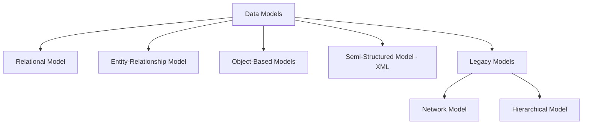
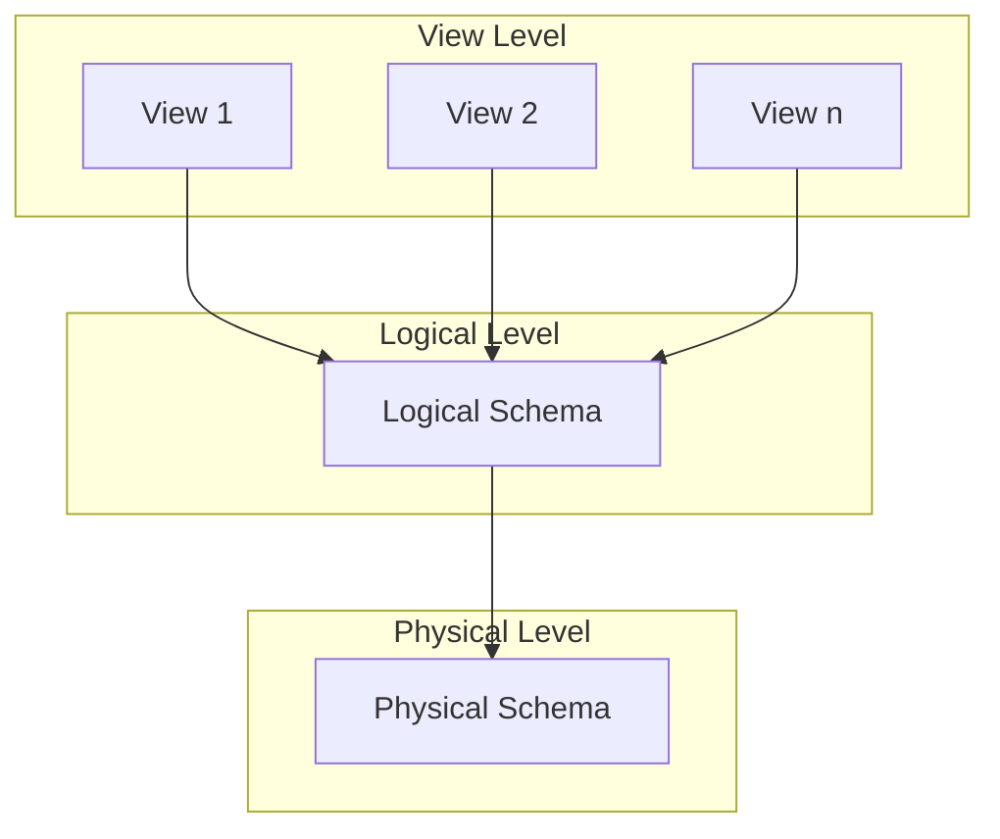
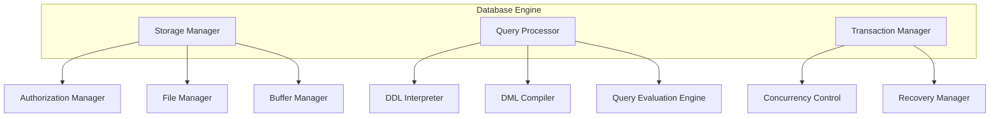
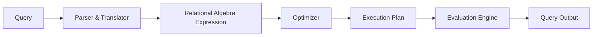
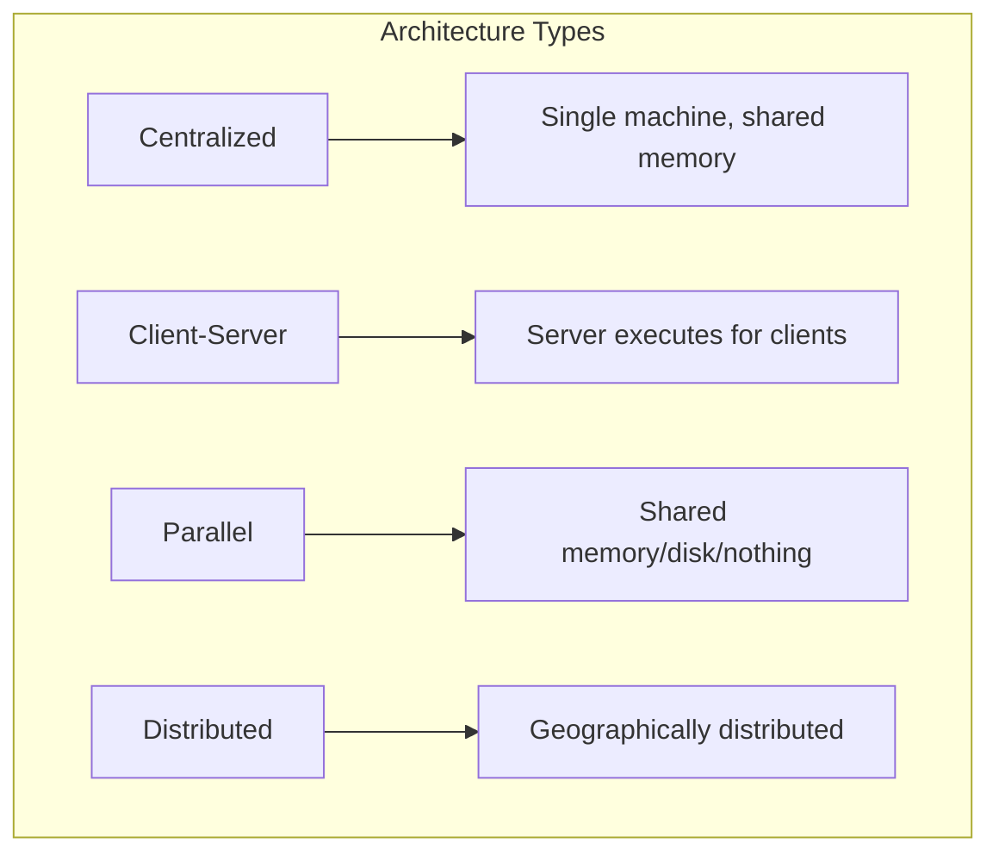
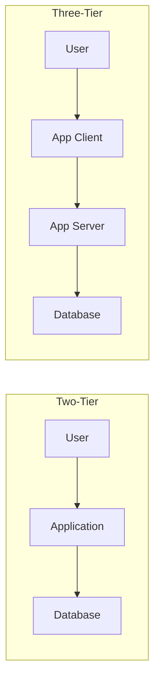

# Chapter 1: Introduction to Database Systems

## Overview

A **database** is a collection of interrelated data, and a **Database Management System (DBMS)** is software that manages and provides access to that data.

---

## 1. Database Applications Examples

| Domain | Examples |
|--------|----------|
| **Enterprise** | Sales, Accounting, Human Resources |
| **Manufacturing** | Production, Inventory, Supply Chain |
| **Banking & Finance** | Accounts, Loans, Credit Cards, Stock Trading |
| **Universities** | Registration, Grades |
| **Airlines** | Reservations, Schedules |
| **Telecommunication** | Call Records, Billing |
| **Web Services** | E-commerce, Online Ads |
| **Navigation** | Maps, Routes |

---

## 2. Purpose of Database Systems

### Problems with File-System Approach

| Problem | Description |
|---------|-------------|
| **Data Redundancy & Inconsistency** | Duplication of data in multiple files |
| **Difficulty in Accessing Data** | Need new programs for each task |
| **Data Isolation** | Data scattered in multiple files/formats |
| **Integrity Problems** | Constraints buried in code |
| **Atomicity Problems** | Partial updates on failure |
| **Concurrent Access Issues** | Uncontrolled access leads to inconsistencies |
| **Security Problems** | Hard to restrict partial data access |

---

## 3. Data Models



### Relational Model
- Data stored in **tables** (relations)
- Each table has **rows** (tuples) and **columns** (attributes)
- Invented by **Ted Codd** (Turing Award 1981)

**Example: Instructor Table**

| ID | name | dept_name | salary |
|----|------|-----------|--------|
| 22222 | Einstein | Physics | 95000 |
| 12121 | Wu | Finance | 90000 |
| 45565 | Katz | Comp. Sci. | 75000 |

---

## 4. View of Data (Three-Level Architecture)



| Level | Description |
|-------|-------------|
| **View Level** | What users see (customized views) |
| **Logical Level** | What data is stored and relationships |
| **Physical Level** | How data is physically stored |

### Key Concepts
- **Schema**: Overall structure of the database (like a type)
- **Instance**: Actual data at a point in time (like a value)
- **Physical Data Independence**: Ability to modify physical schema without changing logical schema

---

## 5. Database Languages

### DDL (Data Definition Language)
- Defines database schema
- Creates **data dictionary** (metadata)

```sql
CREATE TABLE instructor (
    ID          CHAR(5),
    name        VARCHAR(20),
    dept_name   VARCHAR(20),
    salary      NUMERIC(8,2)
);
```

### DML (Data Manipulation Language)
- Accesses and updates data
- Also called **Query Language**

| Type | Description |
|------|-------------|
| **Procedural DML** | Specifies *what* data and *how* to get it |
| **Declarative DML** | Specifies only *what* data is needed (e.g., SQL) |

```sql
SELECT name
FROM instructor
WHERE dept_name = 'Comp. Sci.';
```

---

## 6. Database Engine Components



### Storage Manager
- Interface between low-level data and applications
- Manages: Data files, Data dictionary, Indices

### Query Processor
- **DDL Interpreter**: Processes schema definitions
- **DML Compiler**: Translates queries + optimization
- **Query Evaluation Engine**: Executes queries

### Query Processing Flow



---

## 7. Transaction Management

A **transaction** is a collection of operations performing a single logical function.

| Component | Purpose |
|-----------|---------|
| **Transaction Manager** | Ensures database consistency despite failures |
| **Concurrency Control Manager** | Manages concurrent transaction interactions |

---

## 8. Database Architecture



### Application Architectures



---

## 9. Database Users

| User Type | Description |
|-----------|-------------|
| **Naive Users** | Use pre-built applications |
| **Application Programmers** | Write application programs |
| **Sophisticated Users** | Use query languages directly |
| **Specialized Users** | Build specialized applications (CAD, multimedia) |

---

## 10. Database Administrator (DBA)

**Responsibilities:**
- Schema definition and modification
- Storage structure and access method definition
- Authorization management
- Routine maintenance (backup, disk space, performance monitoring)

---

## 11. History of Database Systems

| Era | Key Developments |
|-----|------------------|
| **1950s-60s** | Magnetic tapes, punched cards, sequential access |
| **Late 1960s-70s** | Hard disks, Network/Hierarchical models, Relational model (Codd) |
| **1980s** | Commercial RDBMS, SQL standard, Parallel/Distributed DB |
| **1990s** | Data warehouses, Data mining, Web commerce |
| **2000s** | Big Data (NoSQL), MapReduce |
| **2010s** | SQL on MapReduce, In-memory databases |

---

## Key Takeaways

1. **DBMS solves** file system problems (redundancy, inconsistency, security)
2. **Relational model** organizes data in tables with rows and columns
3. **Three-level architecture** provides data abstraction and independence
4. **SQL** is the standard declarative query language
5. **Transaction management** ensures data consistency and handles concurrency
6. **Database engine** consists of storage manager, query processor, and transaction manager
