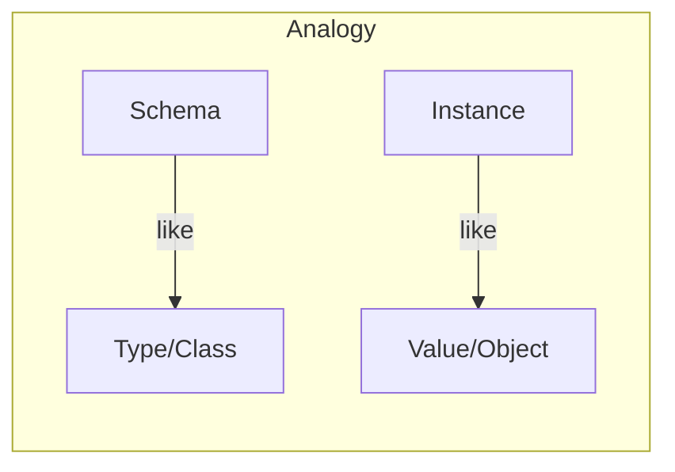
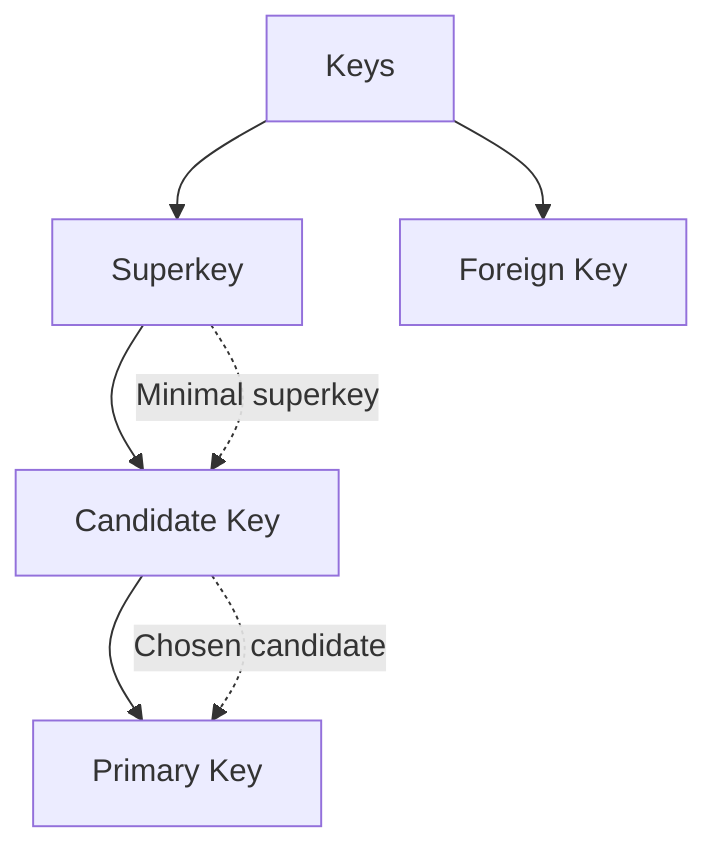
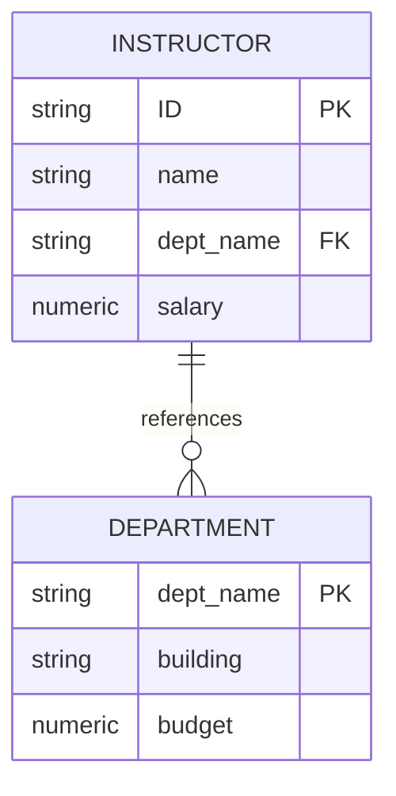
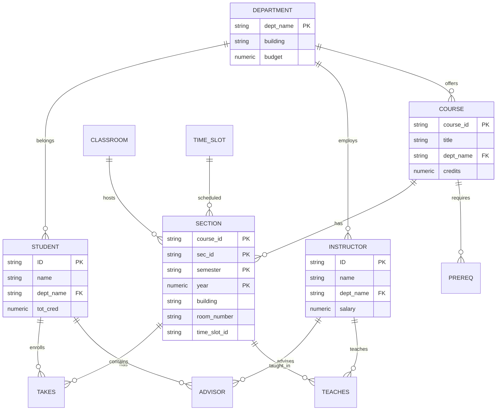

# Chapter 2: Introduction to Relational Model

## Overview

The **Relational Model** is the most widely used data model, where data is organized into **tables** (relations) consisting of **rows** (tuples) and **columns** (attributes).

---

## 1. Structure of Relational Databases

### Basic Terminology

| Term | Also Called | Description |
|------|-------------|-------------|
| **Relation** | Table | A collection of related data |
| **Tuple** | Row / Record | A single data entry in a relation |
| **Attribute** | Column / Field | A property or characteristic |
| **Domain** | - | Set of allowed values for an attribute |

### Example: Instructor Relation

| ID | name | dept_name | salary |
|----|------|-----------|--------|
| 10101 | Srinivasan | Comp. Sci. | 65000 |
| 12121 | Wu | Finance | 90000 |
| 22222 | Einstein | Physics | 95000 |
| 45565 | Katz | Comp. Sci. | 75000 |

### Key Properties of Relations

- **Tuples are unordered** - Order of rows is irrelevant
- **Attribute values are atomic** - Indivisible (no composite/multi-valued)
- **NULL values** - Special value indicating "unknown"

---

## 2. Database Schema vs Instance



| Concept | Description | Example |
|---------|-------------|---------|
| **Schema** | Logical structure (design) | `instructor(ID, name, dept_name, salary)` |
| **Instance** | Actual data at a point in time | The table with current rows |

---

## 3. Keys

### Types of Keys



| Key Type | Definition | Example |
|----------|------------|---------|
| **Superkey** | Set of attributes that uniquely identifies a tuple | {ID}, {ID, name} |
| **Candidate Key** | Minimal superkey (no proper subset is a superkey) | {ID} |
| **Primary Key** | Chosen candidate key for the relation | ID (underlined) |
| **Foreign Key** | Attribute referencing primary key of another relation | dept_name in instructor |

### Foreign Key Constraint



**Rule**: Values in the referencing relation must exist in the referenced relation.

---

## 4. Schema Diagram - University Database



---

## 5. Relational Query Languages

### Classification

| Type | Description | Example |
|------|-------------|---------|
| **Procedural** | Specifies *what* data and *how* to get it | Relational Algebra |
| **Declarative** | Specifies only *what* data is needed | SQL, Tuple/Domain Calculus |

### Pure Languages (Equivalent in Power)

1. **Relational Algebra** - Procedural
2. **Tuple Relational Calculus** - Declarative
3. **Domain Relational Calculus** - Declarative

---

## 6. Relational Algebra Operations

### Six Fundamental Operations

| Operation | Symbol | Type | Description |
|-----------|--------|------|-------------|
| **Select** | σ (sigma) | Unary | Filter rows by condition |
| **Project** | Π (pi) | Unary | Select specific columns |
| **Union** | ∪ | Binary | Combine tuples from two relations |
| **Set Difference** | − | Binary | Tuples in r but not in s |
| **Cartesian Product** | × | Binary | All combinations of tuples |
| **Rename** | ρ (rho) | Unary | Rename relation or attributes |

### Additional Operations

| Operation | Symbol | Description |
|-----------|--------|-------------|
| **Set Intersection** | ∩ | Tuples in both relations |
| **Join** | ⋈ | Combine related tuples |
| **Assignment** | ← | Store intermediate results |

---

## 7. Select Operation (σ)

**Purpose**: Select tuples that satisfy a predicate.

**Notation**: `σ_p(r)` where p is the selection predicate

### Comparison Operators
`=`, `≠`, `>`, `≥`, `<`, `≤`

### Logical Connectives
- `∧` (AND)
- `∨` (OR)
- `¬` (NOT)

### Examples

```
σ_dept_name="Physics"(instructor)
```
Result: All instructors in Physics department

```
σ_dept_name="Physics" ∧ salary>90000(instructor)
```
Result: Physics instructors with salary > 90,000

| ID | name | dept_name | salary |
|----|------|-----------|--------|
| 22222 | Einstein | Physics | 95000 |

---

## 8. Project Operation (Π)

**Purpose**: Return relation with only specified attributes (columns).

**Notation**: `Π_A1,A2,...,Ak(r)`

### Example

```
Π_ID,name,salary(instructor)
```

**Before (instructor)**:
| ID | name | dept_name | salary |
|----|------|-----------|--------|
| 22222 | Einstein | Physics | 95000 |
| 12121 | Wu | Finance | 90000 |

**After**:
| ID | name | salary |
|----|------|--------|
| 22222 | Einstein | 95000 |
| 12121 | Wu | 90000 |

**Note**: Duplicate rows are automatically removed (relations are sets).

---

## 9. Composition of Operations

Operations can be **combined** into expressions:

```
Π_name(σ_dept_name="Physics"(instructor))
```

**Interpretation**: Find names of all Physics instructors


---

## 10. Cartesian Product (×)

**Purpose**: Combine every tuple from r with every tuple from s.

**Notation**: `r × s`

If r has n tuples and s has m tuples, result has **n × m** tuples.

### Example

```
instructor × teaches
```

- Produces all possible combinations
- Common attributes are prefixed: `instructor.ID`, `teaches.ID`

---

## 11. Join Operation (⋈)

**Purpose**: Combine Cartesian product with selection on related attributes.

**Definition**:
```
r ⋈_θ s = σ_θ(r × s)
```

### Example

```
instructor ⋈_instructor.ID=teaches.ID teaches
```

Equivalent to:
```
σ_instructor.ID=teaches.ID(instructor × teaches)
```

---

## 12. Set Operations

### Union (∪)
Combines tuples from both relations (removes duplicates)

```
Π_course_id(σ_semester="Fall" ∧ year=2017(section))
∪
Π_course_id(σ_semester="Spring" ∧ year=2018(section))
```

### Set Intersection (∩)
Returns tuples present in **both** relations

```
Π_course_id(σ_semester="Fall" ∧ year=2017(section))
∩
Π_course_id(σ_semester="Spring" ∧ year=2018(section))
```

### Set Difference (−)
Returns tuples in r but **not** in s

```
Π_course_id(σ_semester="Fall" ∧ year=2017(section))
−
Π_course_id(σ_semester="Spring" ∧ year=2018(section))
```

### Requirements for Set Operations
1. Same **arity** (number of attributes)
2. **Compatible** attribute domains

---

## 13. Assignment (←) and Rename (ρ)

### Assignment Operation
Store intermediate results in temporary variables:

```
Physics ← σ_dept_name="Physics"(instructor)
Music ← σ_dept_name="Music"(instructor)
Physics ∪ Music
```

### Rename Operation
Give names to results or rename attributes:

```
ρ_x(E)           -- rename result to x
ρ_x(A1,A2,...)(E) -- rename result and attributes
```

---

## 14. Aggregate Functions

| Function | Description |
|----------|-------------|
| **avg** | Average value |
| **min** | Minimum value |
| **max** | Maximum value |
| **sum** | Sum of values |
| **count** | Number of values |

### Examples

**Average salary of all instructors:**
```
γ_avg(salary)(instructor)
```

**Average salary by department (GROUP BY):**
```
dept_name γ_avg(salary)(instructor)
```

| dept_name | avg_salary |
|-----------|------------|
| Biology | 72000 |
| Comp. Sci. | 77333 |
| Finance | 85000 |
| Physics | 91000 |

---

## 15. Equivalent Queries

Multiple relational algebra expressions can produce the **same result**.

### Example 1: Different Select Orderings

**Query 1:**
```
σ_dept_name="Physics" ∧ salary>90000(instructor)
```

**Query 2:**
```
σ_dept_name="Physics"(σ_salary>90000(instructor))
```

Both are **equivalent** (same result on any database).

### Example 2: Selection Before vs After Join

**Query 1:**
```
σ_dept_name="Physics"(instructor ⋈ teaches)
```

**Query 2:**
```
(σ_dept_name="Physics"(instructor)) ⋈ teaches
```

Query 2 is typically **more efficient** (filters before join).

---

## Summary Table: Relational Algebra Operations

| Operation | Symbol | Input | Output | Purpose |
|-----------|--------|-------|--------|---------|
| Select | σ | 1 relation | Subset of tuples | Filter rows |
| Project | Π | 1 relation | Subset of attributes | Choose columns |
| Union | ∪ | 2 relations | Combined tuples | OR logic |
| Difference | − | 2 relations | Tuples in r not in s | Exclusion |
| Intersection | ∩ | 2 relations | Common tuples | AND logic |
| Cartesian Product | × | 2 relations | All combinations | Combine all |
| Join | ⋈ | 2 relations | Related tuples | Combine related |
| Rename | ρ | 1 relation | Same with new name | Aliasing |
| Assignment | ← | Expression | Temporary variable | Store result |

---

## Key Takeaways

1. **Relational model** organizes data into tables with rows and columns
2. **Keys** ensure uniqueness and establish relationships between tables
3. **Relational algebra** provides a procedural query language with six fundamental operations
4. Operations can be **composed** to form complex queries
5. **Equivalent queries** produce the same result but may have different performance
6. **Aggregate functions** enable computations over groups of tuples
