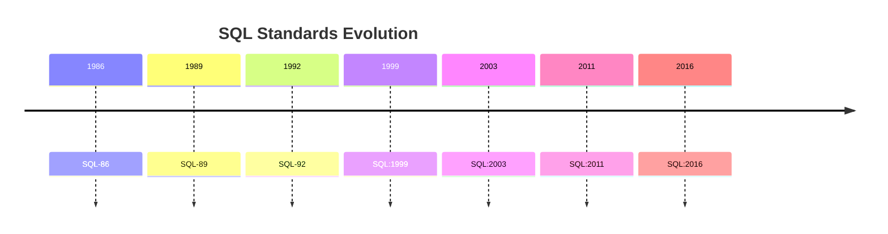
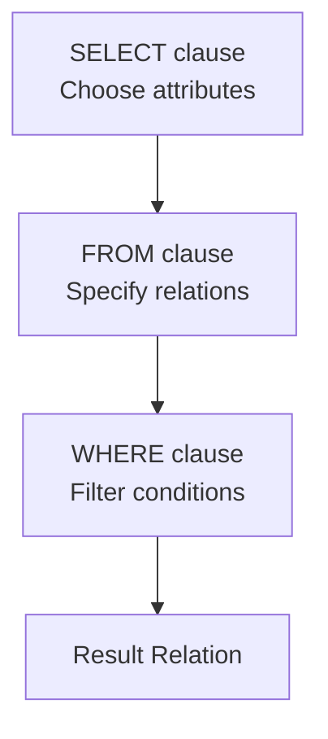
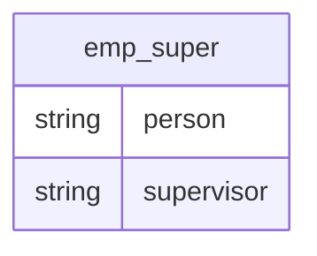
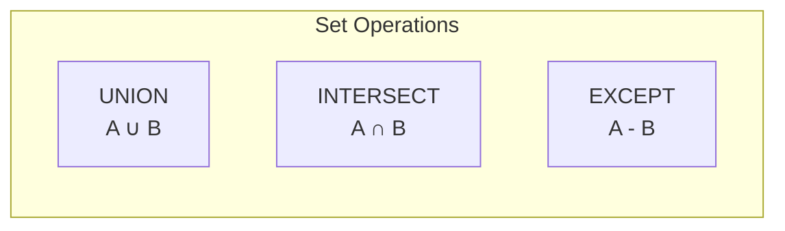
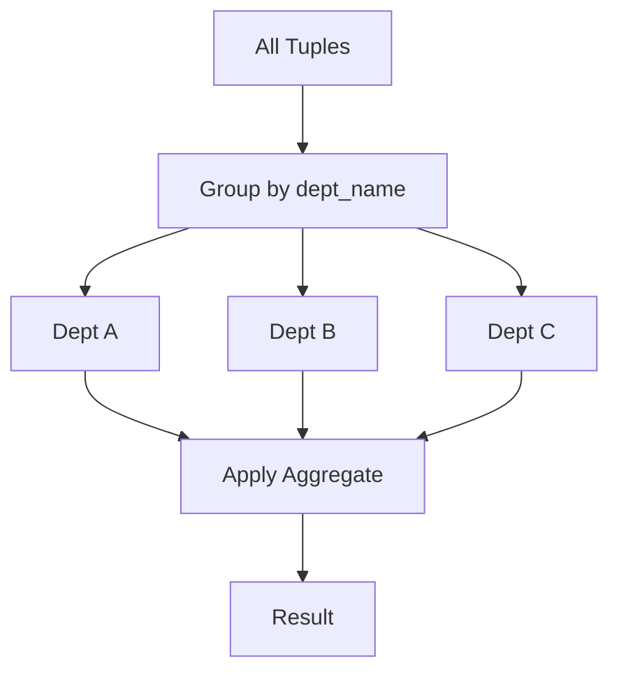
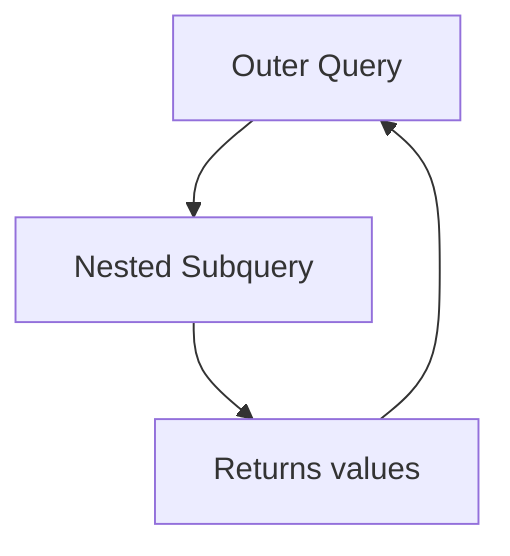
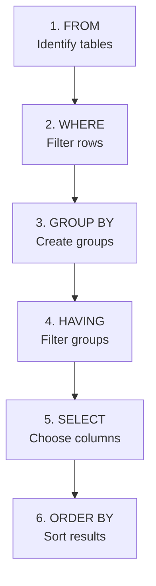

# Chapter 3: Introduction to SQL

## Overview

SQL (Structured Query Language) is the standard language for relational database management systems. Originally developed at IBM as SEQUEL, it has evolved through multiple ANSI/ISO standards.



---

## SQL Components

| Component | Description |
|-----------|-------------|
| **DML** | Data Manipulation Language - query, insert, update, delete |
| **DDL** | Data Definition Language - define schema, integrity constraints |
| **View Definition** | Commands for defining views |
| **Transaction Control** | Begin and end transactions |
| **Embedded SQL** | SQL embedded in programming languages |
| **Authorization** | Access rights to relations and views |

---

## Data Definition Language (DDL)

### Domain Types in SQL

| Type | Description | Example |
|------|-------------|---------|
| `char(n)` | Fixed-length string | `char(5)` = 'Hello' |
| `varchar(n)` | Variable-length string (max n) | `varchar(20)` |
| `int` | Integer | 42 |
| `smallint` | Small integer | 100 |
| `numeric(p,d)` | Fixed-point number (p digits, d decimal) | `numeric(8,2)` = 12345.67 |
| `real` | Floating-point | 3.14159 |
| `double precision` | Double-precision floating | 3.141592653589793 |
| `float(n)` | Floating-point with n digits precision | `float(10)` |

### Create Table Syntax

```sql
CREATE TABLE table_name (
    attribute1 datatype1,
    attribute2 datatype2,
    ...,
    integrity_constraint1,
    integrity_constraint2
);
```

**Example - University Database:**

```sql
CREATE TABLE instructor (
    ID          char(5),
    name        varchar(20) NOT NULL,
    dept_name   varchar(20),
    salary      numeric(8,2),
    PRIMARY KEY (ID),
    FOREIGN KEY (dept_name) REFERENCES department
);

CREATE TABLE student (
    ID          varchar(5),
    name        varchar(20) NOT NULL,
    dept_name   varchar(20),
    tot_cred    numeric(3,0),
    PRIMARY KEY (ID),
    FOREIGN KEY (dept_name) REFERENCES department
);

CREATE TABLE course (
    course_id   varchar(8),
    title       varchar(50),
    dept_name   varchar(20),
    credits     numeric(2,0),
    PRIMARY KEY (course_id),
    FOREIGN KEY (dept_name) REFERENCES department
);
```

### Integrity Constraints

| Constraint | Description |
|------------|-------------|
| `PRIMARY KEY` | Uniquely identifies each tuple |
| `FOREIGN KEY ... REFERENCES` | References primary key of another table |
| `NOT NULL` | Attribute cannot be null |

### Table Modifications

```sql
-- Insert a new tuple
INSERT INTO instructor VALUES ('10211', 'Smith', 'Biology', 66000);

-- Delete all tuples
DELETE FROM student;

-- Drop entire table
DROP TABLE r;

-- Add new attribute
ALTER TABLE r ADD A D;

-- Remove attribute
ALTER TABLE r DROP A;
```

---

## Basic Query Structure



### General Form

```sql
SELECT A1, A2, ..., An
FROM r1, r2, ..., rm
WHERE P;
```

| Clause | Purpose | Relational Algebra |
|--------|---------|-------------------|
| SELECT | List attributes for result | Projection (π) |
| FROM | List relations involved | Cartesian Product (×) |
| WHERE | Specify selection conditions | Selection (σ) |

---

## SELECT Clause

### Basic Selection

```sql
-- Select specific attributes
SELECT name FROM instructor;

-- Select all attributes
SELECT * FROM instructor;

-- Remove duplicates
SELECT DISTINCT dept_name FROM instructor;

-- Keep duplicates (default)
SELECT ALL dept_name FROM instructor;
```

### Arithmetic Expressions

```sql
-- Arithmetic in SELECT
SELECT ID, name, salary/12 AS monthly_salary
FROM instructor;
```

### Literals

```sql
-- Literal without FROM
SELECT '437' AS FOO;

-- Literal with FROM (repeats for each tuple)
SELECT 'A' FROM instructor;
```

---

## WHERE Clause

### Comparison Operators

| Operator | Meaning |
|----------|---------|
| `=` | Equal |
| `<>` or `!=` | Not equal |
| `<` | Less than |
| `<=` | Less than or equal |
| `>` | Greater than |
| `>=` | Greater than or equal |

### Logical Operators

```sql
-- Using AND, OR, NOT
SELECT name
FROM instructor
WHERE dept_name = 'Comp. Sci.' AND salary > 80000;
```

### BETWEEN Operator

```sql
-- Salary between 90000 and 100000
SELECT name
FROM instructor
WHERE salary BETWEEN 90000 AND 100000;
```

---

## FROM Clause and Joins

### Cartesian Product

```sql
-- All combinations of instructor and teaches
SELECT *
FROM instructor, teaches;
```

### Join with WHERE Condition

```sql
-- Natural join using WHERE
SELECT name, course_id
FROM instructor, teaches
WHERE instructor.ID = teaches.ID;

-- With additional conditions
SELECT name, course_id
FROM instructor, teaches
WHERE instructor.ID = teaches.ID
  AND instructor.dept_name = 'Art';
```

---

## Rename Operation (AS)

```sql
-- Rename relation
SELECT T.name
FROM instructor AS T, instructor AS S
WHERE T.salary > S.salary
  AND S.dept_name = 'Comp. Sci.';
```

### Self-Join Example



```sql
-- Find supervisor of 'Bob'
SELECT supervisor
FROM emp_super
WHERE person = 'Bob';

-- Find supervisor's supervisor
SELECT S2.supervisor
FROM emp_super AS S1, emp_super AS S2
WHERE S1.person = 'Bob'
  AND S1.supervisor = S2.person;
```

---

## String Operations

### LIKE Operator

| Pattern | Matches |
|---------|---------|
| `%` | Any substring (including empty) |
| `_` | Any single character |

```sql
-- Name contains 'dar'
SELECT name
FROM instructor
WHERE name LIKE '%dar%';

-- Exactly 3 characters
WHERE name LIKE '___';

-- At least 3 characters
WHERE name LIKE '___%';

-- Escape special characters
WHERE title LIKE '100\%' ESCAPE '\';
```

### String Functions

- Concatenation: `||`
- Case conversion: `UPPER()`, `LOWER()`
- Length: `LENGTH()`
- Substring: `SUBSTRING()`

---

## Ordering Results

```sql
-- Ascending order (default)
SELECT DISTINCT name
FROM instructor
ORDER BY name;

-- Descending order
ORDER BY name DESC;

-- Multiple columns
ORDER BY dept_name, name;
```

---

## Set Operations



| Operation | Description | Keeps Duplicates |
|-----------|-------------|------------------|
| `UNION` | Combines results | No |
| `UNION ALL` | Combines results | Yes |
| `INTERSECT` | Common elements | No |
| `INTERSECT ALL` | Common elements | Yes |
| `EXCEPT` | Difference | No |
| `EXCEPT ALL` | Difference | Yes |

```sql
-- Courses in Fall 2017 OR Spring 2018
(SELECT course_id FROM section WHERE semester = 'Fall' AND year = 2017)
UNION
(SELECT course_id FROM section WHERE semester = 'Spring' AND year = 2018);

-- Courses in Fall 2017 AND Spring 2018
(SELECT course_id FROM section WHERE semester = 'Fall' AND year = 2017)
INTERSECT
(SELECT course_id FROM section WHERE semester = 'Spring' AND year = 2018);

-- Courses in Fall 2017 but NOT in Spring 2018
(SELECT course_id FROM section WHERE semester = 'Fall' AND year = 2017)
EXCEPT
(SELECT course_id FROM section WHERE semester = 'Spring' AND year = 2018);
```

---

## NULL Values

### Three-Valued Logic

| Operation | Result |
|-----------|--------|
| `5 + NULL` | NULL |
| `5 < NULL` | UNKNOWN |
| `NULL = NULL` | UNKNOWN |
| `NULL <> NULL` | UNKNOWN |

### Boolean Operations with UNKNOWN

| Expression | Result |
|------------|--------|
| `TRUE AND UNKNOWN` | UNKNOWN |
| `FALSE AND UNKNOWN` | FALSE |
| `TRUE OR UNKNOWN` | TRUE |
| `FALSE OR UNKNOWN` | UNKNOWN |

```sql
-- Check for NULL
SELECT name
FROM instructor
WHERE salary IS NULL;

-- Check for NOT NULL
SELECT name
FROM instructor
WHERE salary IS NOT NULL;
```

---

## Aggregate Functions

| Function | Description |
|----------|-------------|
| `AVG(column)` | Average value |
| `MIN(column)` | Minimum value |
| `MAX(column)` | Maximum value |
| `SUM(column)` | Sum of values |
| `COUNT(column)` | Number of values |
| `COUNT(*)` | Number of tuples |
| `COUNT(DISTINCT col)` | Number of distinct values |

```sql
-- Average salary in Comp. Sci.
SELECT AVG(salary)
FROM instructor
WHERE dept_name = 'Comp. Sci.';

-- Count distinct instructors teaching in Spring 2018
SELECT COUNT(DISTINCT ID)
FROM teaches
WHERE semester = 'Spring' AND year = 2018;

-- Count all tuples in course
SELECT COUNT(*)
FROM course;
```

---

## GROUP BY Clause



```sql
-- Average salary by department
SELECT dept_name, AVG(salary) AS avg_salary
FROM instructor
GROUP BY dept_name;
```

**Important Rule:** Attributes in SELECT (outside aggregate functions) MUST appear in GROUP BY.

```sql
-- INCORRECT: ID not in GROUP BY
SELECT dept_name, ID, AVG(salary)
FROM instructor
GROUP BY dept_name;  -- ERROR!
```

---

## HAVING Clause

```sql
-- Departments with average salary > 42000
SELECT dept_name, AVG(salary) AS avg_salary
FROM instructor
GROUP BY dept_name
HAVING AVG(salary) > 42000;
```

| Clause | Applies | When |
|--------|---------|------|
| WHERE | To individual tuples | Before grouping |
| HAVING | To groups | After grouping |

---

## Nested Subqueries



### Set Membership (IN / NOT IN)

```sql
-- Courses in both Fall 2017 and Spring 2018
SELECT DISTINCT course_id
FROM section
WHERE semester = 'Fall' AND year = 2017
  AND course_id IN (SELECT course_id
                    FROM section
                    WHERE semester = 'Spring' AND year = 2018);

-- Names not in list
SELECT DISTINCT name
FROM instructor
WHERE name NOT IN ('Mozart', 'Einstein');
```

### Set Comparison (SOME / ALL)

```sql
-- Salary greater than SOME instructor in Biology
SELECT name
FROM instructor
WHERE salary > SOME (SELECT salary
                     FROM instructor
                     WHERE dept_name = 'Biology');

-- Salary greater than ALL instructors in Biology
SELECT name
FROM instructor
WHERE salary > ALL (SELECT salary
                    FROM instructor
                    WHERE dept_name = 'Biology');
```

| Expression | Equivalent |
|------------|------------|
| `= SOME` | IN |
| `<> SOME` | ≠ NOT IN |
| `= ALL` | ≠ IN |
| `<> ALL` | NOT IN |

### EXISTS / NOT EXISTS

```sql
-- Courses in both semesters using EXISTS
SELECT course_id
FROM section AS S
WHERE semester = 'Fall' AND year = 2017
  AND EXISTS (SELECT *
              FROM section AS T
              WHERE semester = 'Spring' AND year = 2018
                AND S.course_id = T.course_id);

-- Students who took ALL Biology courses
SELECT DISTINCT S.ID, S.name
FROM student AS S
WHERE NOT EXISTS (
    (SELECT course_id FROM course WHERE dept_name = 'Biology')
    EXCEPT
    (SELECT T.course_id FROM takes AS T WHERE S.ID = T.ID)
);
```

### UNIQUE (Test for Duplicates)

```sql
-- Courses offered at most once in 2017
SELECT T.course_id
FROM course AS T
WHERE UNIQUE (SELECT R.course_id
              FROM section AS R
              WHERE T.course_id = R.course_id
                AND R.year = 2017);
```

---

## Subqueries in FROM Clause

```sql
-- Departments with avg salary > 42000 (using subquery)
SELECT dept_name, avg_salary
FROM (SELECT dept_name, AVG(salary) AS avg_salary
      FROM instructor
      GROUP BY dept_name) AS dept_avg
WHERE avg_salary > 42000;
```

---

## WITH Clause (Common Table Expression)

```sql
-- Find department(s) with maximum budget
WITH max_budget(value) AS (
    SELECT MAX(budget)
    FROM department
)
SELECT department.name
FROM department, max_budget
WHERE department.budget = max_budget.value;

-- Complex example: departments with total salary above average
WITH dept_total(dept_name, value) AS (
    SELECT dept_name, SUM(salary)
    FROM instructor
    GROUP BY dept_name
),
dept_total_avg(value) AS (
    SELECT AVG(value)
    FROM dept_total
)
SELECT dept_name
FROM dept_total, dept_total_avg
WHERE dept_total.value > dept_total_avg.value;
```

---

## Scalar Subquery

A subquery that returns a single value.

```sql
-- List departments with instructor count
SELECT dept_name,
       (SELECT COUNT(*)
        FROM instructor
        WHERE department.dept_name = instructor.dept_name) AS num_instructors
FROM department;
```

---

## Data Modification

### DELETE

```sql
-- Delete all instructors
DELETE FROM instructor;

-- Delete with condition
DELETE FROM instructor
WHERE dept_name = 'Finance';

-- Delete with subquery
DELETE FROM instructor
WHERE dept_name IN (SELECT dept_name
                    FROM department
                    WHERE building = 'Watson');

-- Delete based on aggregate (evaluated first, then deleted)
DELETE FROM instructor
WHERE salary < (SELECT AVG(salary) FROM instructor);
```

### INSERT

```sql
-- Insert with values
INSERT INTO course
VALUES ('CS-437', 'Database Systems', 'Comp. Sci.', 4);

-- Insert with column names
INSERT INTO course (course_id, title, dept_name, credits)
VALUES ('CS-437', 'Database Systems', 'Comp. Sci.', 4);

-- Insert with NULL
INSERT INTO student
VALUES ('3003', 'Green', 'Finance', NULL);

-- Insert from SELECT
INSERT INTO instructor
SELECT ID, name, dept_name, 18000
FROM student
WHERE dept_name = 'Music' AND total_cred > 144;
```

### UPDATE

```sql
-- Update all tuples
UPDATE instructor
SET salary = salary * 1.05;

-- Update with condition
UPDATE instructor
SET salary = salary * 1.05
WHERE salary < 70000;

-- Update with subquery
UPDATE instructor
SET salary = salary * 1.05
WHERE salary < (SELECT AVG(salary) FROM instructor);
```

### CASE Statement

```sql
-- Conditional update
UPDATE instructor
SET salary = CASE
    WHEN salary <= 100000 THEN salary * 1.05
    ELSE salary * 1.03
END;
```

### Update with Scalar Subquery

```sql
-- Recompute total credits for all students
UPDATE student S
SET tot_cred = (
    SELECT CASE
        WHEN SUM(credits) IS NOT NULL THEN SUM(credits)
        ELSE 0
    END
    FROM takes, course
    WHERE takes.course_id = course.course_id
      AND S.ID = takes.ID
      AND takes.grade <> 'F'
      AND takes.grade IS NOT NULL
);
```

---

## SQL Query Processing Order



---

## Key Concepts Summary

| Concept | SQL Keyword | Description |
|---------|-------------|-------------|
| Selection | WHERE | Filter rows |
| Projection | SELECT | Choose columns |
| Join | FROM + WHERE | Combine tables |
| Aggregation | GROUP BY + Functions | Summarize data |
| Sorting | ORDER BY | Order results |
| Set Operations | UNION, INTERSECT, EXCEPT | Combine queries |
| Subqueries | IN, EXISTS, SOME, ALL | Nested queries |
| Modification | INSERT, UPDATE, DELETE | Change data |
