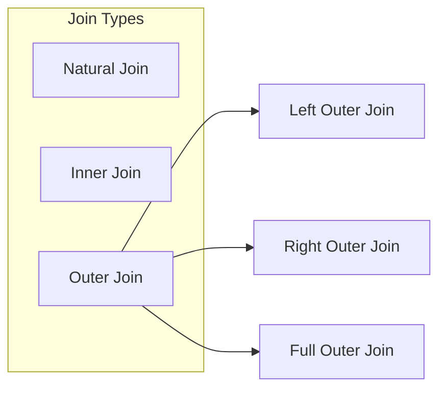
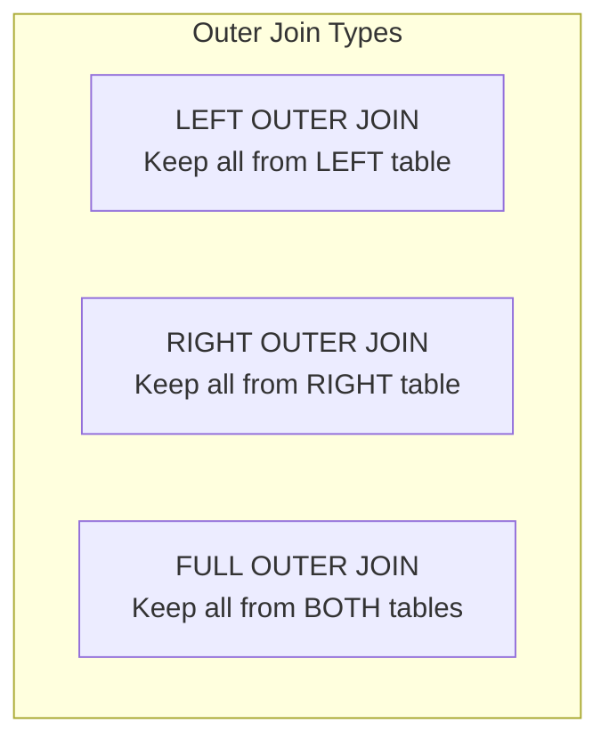
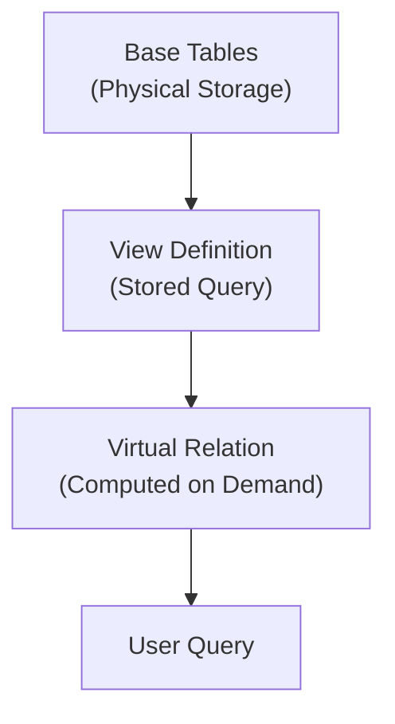
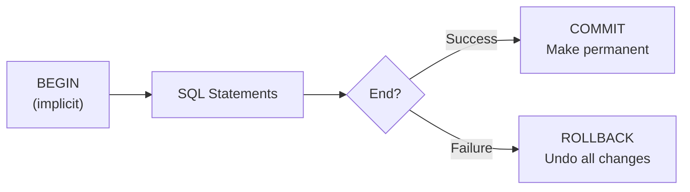
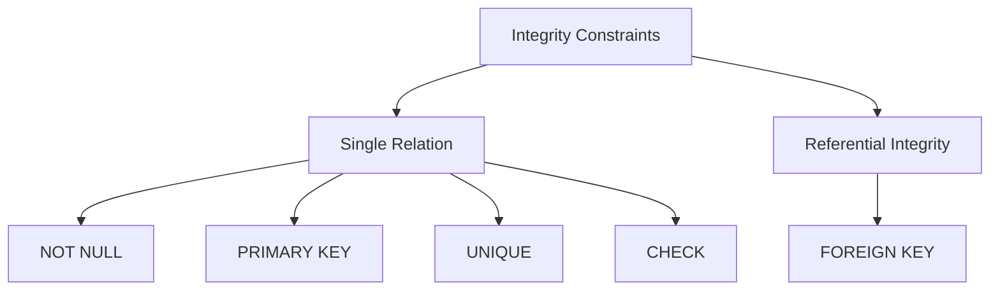
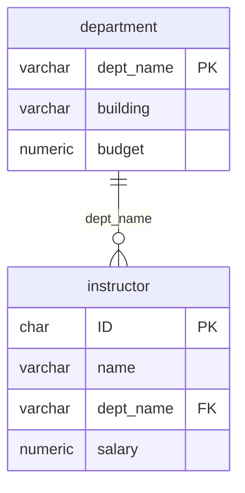
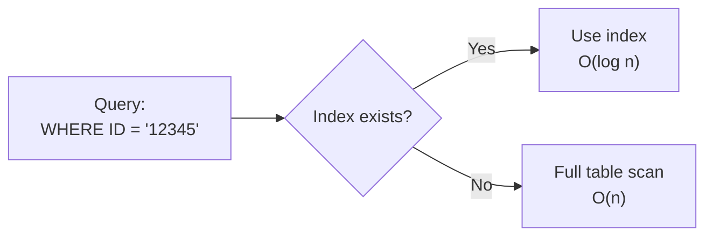
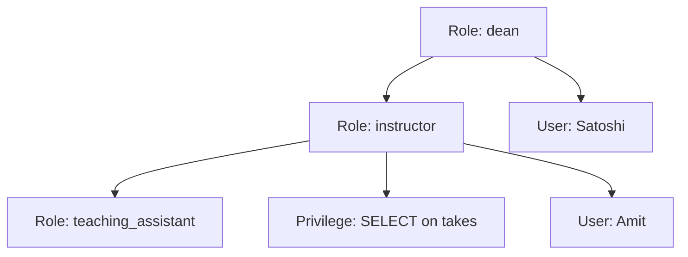

# Chapter 4: Intermediate SQL

## Overview

This chapter covers advanced SQL features including join expressions, views, transactions, integrity constraints, data types, indexes, and authorization.

---

## Join Expressions

Join operations combine two relations and return a result relation based on matching conditions.



### Natural Join

Matches tuples with the same values for **all common attributes** and retains only one copy of each common column.

```sql
-- Without natural join
SELECT name, course_id
FROM student, takes
WHERE student.ID = takes.ID;

-- With natural join
SELECT name, course_id
FROM student NATURAL JOIN takes;

-- Multiple natural joins
SELECT A1, A2, ..., An
FROM r1 NATURAL JOIN r2 NATURAL JOIN ... NATURAL JOIN rn
WHERE P;
```

**Warning:** Be careful with unrelated attributes having the same name!

```sql
-- INCORRECT: May omit valid pairs due to dept_name match
SELECT name, title
FROM student NATURAL JOIN takes NATURAL JOIN course;

-- CORRECT: Explicitly specify join condition
SELECT name, title
FROM student NATURAL JOIN takes, course
WHERE takes.course_id = course.course_id;
```

### Outer Joins

Outer joins preserve tuples that don't have matches in the other relation by using NULL values.



| Join Type | Symbol | Description |
|-----------|--------|-------------|
| Left Outer Join | ⟕ | Keeps all tuples from left relation |
| Right Outer Join | ⟖ | Keeps all tuples from right relation |
| Full Outer Join | ⟗ | Keeps all tuples from both relations |

**Example Tables:**

| course_id | title | dept_name |
|-----------|-------|-----------|
| CS-101 | Intro to CS | Comp. Sci. |
| CS-315 | Robotics | Comp. Sci. |

| course_id | prereq_id |
|-----------|-----------|
| CS-101 | CS-001 |
| CS-437 | CS-315 |

```sql
-- Left outer join: keeps CS-315 (no prereq)
SELECT *
FROM course NATURAL LEFT OUTER JOIN prereq;

-- Right outer join: keeps CS-437 (no course info)
SELECT *
FROM course NATURAL RIGHT OUTER JOIN prereq;

-- Full outer join: keeps both unmatched tuples
SELECT *
FROM course NATURAL FULL OUTER JOIN prereq;
```

### Join Conditions

| Syntax | Description |
|--------|-------------|
| `NATURAL JOIN` | Match on all common attributes |
| `JOIN ... ON condition` | Explicit join condition |
| `JOIN ... USING (attr)` | Match on specified attributes |

```sql
-- Inner join with ON
SELECT *
FROM course INNER JOIN prereq
ON course.course_id = prereq.course_id;

-- Join with USING
SELECT *
FROM course FULL OUTER JOIN prereq
USING (course_id);

-- Left outer join with ON
SELECT *
FROM course LEFT OUTER JOIN prereq
ON course.course_id = prereq.course_id;
```

---

## Views

A **view** is a virtual relation defined by a query. It provides a mechanism to hide certain data from users.



### View Definition

```sql
CREATE VIEW view_name AS
<query expression>;

-- View with renamed columns
CREATE VIEW view_name (col1, col2, ...) AS
<query expression>;
```

**Examples:**

```sql
-- View hiding salary information
CREATE VIEW faculty AS
SELECT ID, name, dept_name
FROM instructor;

-- Using the view
SELECT name
FROM faculty
WHERE dept_name = 'Biology';

-- View with aggregation
CREATE VIEW departments_total_salary(dept_name, total_salary) AS
SELECT dept_name, SUM(salary)
FROM instructor
GROUP BY dept_name;
```

### Views Defined Using Other Views

```sql
-- First view
CREATE VIEW physics_fall_2017 AS
SELECT course.course_id, sec_id, building, room_number
FROM course, section
WHERE course.course_id = section.course_id
  AND course.dept_name = 'Physics'
  AND section.semester = 'Fall'
  AND section.year = '2017';

-- Second view based on first
CREATE VIEW physics_fall_2017_watson AS
SELECT course_id, room_number
FROM physics_fall_2017
WHERE building = 'Watson';
```

### View Expansion

When a view is queried, the system replaces the view with its definition:


### Materialized Views

| Type | Storage | Updates |
|------|---------|---------|
| Regular View | Not stored | Computed on each query |
| Materialized View | Physically stored | Must be maintained when base tables change |

### Updatable Views

Views are updatable only if they meet these conditions:

| Requirement | Description |
|-------------|-------------|
| Single relation | FROM clause has only one table |
| Simple SELECT | No expressions, aggregates, or DISTINCT |
| NULL allowed | Unlisted attributes can be set to NULL |
| No grouping | No GROUP BY or HAVING clause |

```sql
-- This insert on view...
INSERT INTO faculty VALUES ('30765', 'Green', 'Music');

-- ...translates to insert on base table with NULL salary
INSERT INTO instructor VALUES ('30765', 'Green', 'Music', NULL);
```

---

## Transactions

A **transaction** is a unit of work consisting of a sequence of query and/or update statements.



### Transaction Properties

| Property | Description |
|----------|-------------|
| **Atomic** | Either fully executed or completely rolled back |
| **Isolated** | Concurrent transactions don't interfere |

```sql
-- Commit changes
COMMIT WORK;

-- Rollback changes
ROLLBACK WORK;
```

---

## Integrity Constraints

Integrity constraints ensure data consistency and guard against accidental damage.



### Single Relation Constraints

| Constraint | Description | Example |
|------------|-------------|---------|
| `NOT NULL` | Attribute cannot be null | `name VARCHAR(20) NOT NULL` |
| `PRIMARY KEY` | Unique identifier, not null | `PRIMARY KEY (ID)` |
| `UNIQUE` | Candidate key (can be null) | `UNIQUE (email)` |
| `CHECK (P)` | Predicate P must be satisfied | `CHECK (salary > 0)` |

```sql
CREATE TABLE section (
    course_id   VARCHAR(8),
    sec_id      VARCHAR(8),
    semester    VARCHAR(6),
    year        NUMERIC(4,0),
    building    VARCHAR(15),
    room_number VARCHAR(7),
    time_slot_id VARCHAR(4),
    PRIMARY KEY (course_id, sec_id, semester, year),
    CHECK (semester IN ('Fall', 'Winter', 'Spring', 'Summer'))
);
```

### Referential Integrity (Foreign Keys)



```sql
-- Basic foreign key
FOREIGN KEY (dept_name) REFERENCES department

-- Explicit attribute reference
FOREIGN KEY (dept_name) REFERENCES department(dept_name)
```

### Cascading Actions

| Action | On DELETE | On UPDATE |
|--------|-----------|-----------|
| `CASCADE` | Delete referencing tuples | Update referencing values |
| `SET NULL` | Set foreign key to NULL | Set foreign key to NULL |
| `SET DEFAULT` | Set to default value | Set to default value |
| `NO ACTION` | Reject if references exist | Reject if references exist |

```sql
CREATE TABLE course (
    course_id   VARCHAR(8),
    title       VARCHAR(50),
    dept_name   VARCHAR(20),
    credits     NUMERIC(2,0),
    FOREIGN KEY (dept_name) REFERENCES department
        ON DELETE CASCADE
        ON UPDATE CASCADE
);
```

### Complex Check Conditions

```sql
-- Check with subquery
CHECK (time_slot_id IN (SELECT time_slot_id FROM time_slot))
```

### Assertions

Database-wide constraints that must always be satisfied:

```sql
CREATE ASSERTION assertion_name CHECK (predicate);

-- Example: Ensure total credits equals sum of completed courses
CREATE ASSERTION credits_check CHECK (
    NOT EXISTS (
        SELECT * FROM student
        WHERE tot_cred <> (
            SELECT COALESCE(SUM(credits), 0)
            FROM takes NATURAL JOIN course
            WHERE takes.ID = student.ID
              AND grade IS NOT NULL
              AND grade <> 'F'
        )
    )
);
```

---

## SQL Data Types and Schemas

### Built-in Data Types

| Type | Description | Example |
|------|-------------|---------|
| `DATE` | Year, month, day | `DATE '2005-07-27'` |
| `TIME` | Hours, minutes, seconds | `TIME '09:00:30.75'` |
| `TIMESTAMP` | Date + time | `TIMESTAMP '2005-07-27 09:00:30.75'` |
| `INTERVAL` | Period of time | `INTERVAL '1' DAY` |

```sql
-- Interval arithmetic
SELECT current_date + INTERVAL '1' MONTH;

-- Date subtraction gives interval
SELECT end_date - start_date FROM projects;
```

### Large Object Types

| Type | Description | Use Case |
|------|-------------|----------|
| `BLOB` | Binary Large Object | Photos, videos, CAD files |
| `CLOB` | Character Large Object | Large text documents |

**Note:** Queries return a pointer to large objects, not the objects themselves.

### User-Defined Types

```sql
-- Create custom type
CREATE TYPE Dollars AS NUMERIC(12,2) FINAL;

-- Use in table definition
CREATE TABLE department (
    dept_name VARCHAR(20),
    building  VARCHAR(15),
    budget    Dollars
);
```

### Domains

```sql
-- Create domain with constraint
CREATE DOMAIN person_name CHAR(20) NOT NULL;

CREATE DOMAIN degree_level VARCHAR(10)
    CONSTRAINT degree_level_test
    CHECK (value IN ('Bachelors', 'Masters', 'Doctorate'));
```

| Feature | Type | Domain |
|---------|------|--------|
| Constraints | No | Yes |
| NULL handling | N/A | Can specify NOT NULL |
| Check constraints | No | Yes |

---

## Index Definition

Indexes improve query performance by allowing efficient lookup without scanning all tuples.



```sql
-- Create index
CREATE INDEX index_name ON relation_name(attribute);

-- Example
CREATE INDEX studentID_index ON student(ID);

-- Query using index
SELECT *
FROM student
WHERE ID = '12345';  -- Uses studentID_index
```

---

## Authorization

Authorization controls what users can access and modify in the database.

### Privilege Types

| Data Privileges | Description |
|-----------------|-------------|
| `SELECT` | Read data |
| `INSERT` | Add new tuples |
| `UPDATE` | Modify existing tuples |
| `DELETE` | Remove tuples |

| Schema Privileges | Description |
|-------------------|-------------|
| `INDEX` | Create/delete indexes |
| `RESOURCES` | Create new relations |
| `ALTERATION` | Add/delete attributes |
| `DROP` | Delete relations |

### GRANT Statement

```sql
GRANT <privilege list> ON <relation or view> TO <user list>;

-- Examples
GRANT SELECT ON department TO Amit, Satoshi;
GRANT SELECT, INSERT ON instructor TO U1, U2, U3;
GRANT ALL PRIVILEGES ON student TO admin;

-- Grant to all users
GRANT SELECT ON course TO PUBLIC;
```

### REVOKE Statement

```sql
REVOKE <privilege list> ON <relation or view> FROM <user list>;

-- Examples
REVOKE SELECT ON student FROM U1, U2, U3;
REVOKE ALL ON instructor FROM Amit;
```

### Roles

Roles group privileges for easier management:



```sql
-- Create role
CREATE ROLE instructor;

-- Assign user to role
GRANT instructor TO Amit;

-- Grant privileges to role
GRANT SELECT ON takes TO instructor;

-- Role hierarchy
CREATE ROLE teaching_assistant;
GRANT teaching_assistant TO instructor;

CREATE ROLE dean;
GRANT instructor TO dean;
GRANT dean TO Satoshi;
```

### Authorization on Views

```sql
-- Create view
CREATE VIEW geo_instructor AS
SELECT * FROM instructor
WHERE dept_name = 'Geology';

-- Grant access to view
GRANT SELECT ON geo_instructor TO geo_staff;
```

**Important:** Granting privilege on a view does NOT grant privilege on underlying tables.

### Additional Authorization Features

```sql
-- Grant REFERENCES privilege (for foreign keys)
GRANT REFERENCES (dept_name) ON department TO Mariano;

-- Grant with ability to pass on privilege
GRANT SELECT ON department TO Amit WITH GRANT OPTION;

-- Revoke with cascade (revokes dependent privileges)
REVOKE SELECT ON department FROM Amit, Satoshi CASCADE;

-- Revoke with restrict (fails if dependent privileges exist)
REVOKE SELECT ON department FROM Amit, Satoshi RESTRICT;
```

---

## Summary Table

| Topic | Key Concepts |
|-------|--------------|
| **Joins** | Natural, Inner, Left/Right/Full Outer |
| **Views** | Virtual relations, updatable conditions, materialized |
| **Transactions** | COMMIT, ROLLBACK, atomicity, isolation |
| **Constraints** | NOT NULL, PRIMARY KEY, UNIQUE, CHECK, FOREIGN KEY |
| **Cascading** | CASCADE, SET NULL, SET DEFAULT |
| **Data Types** | DATE, TIME, TIMESTAMP, INTERVAL, BLOB, CLOB |
| **User-Defined** | CREATE TYPE, CREATE DOMAIN |
| **Indexes** | CREATE INDEX for efficient lookup |
| **Authorization** | GRANT, REVOKE, roles, privileges |
