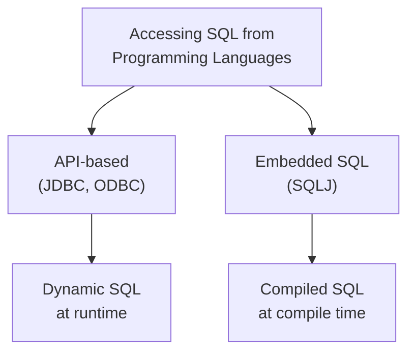
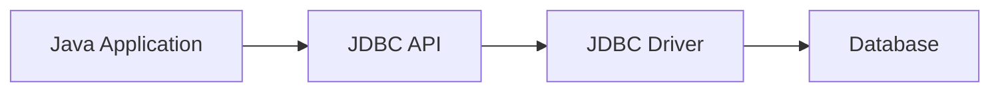
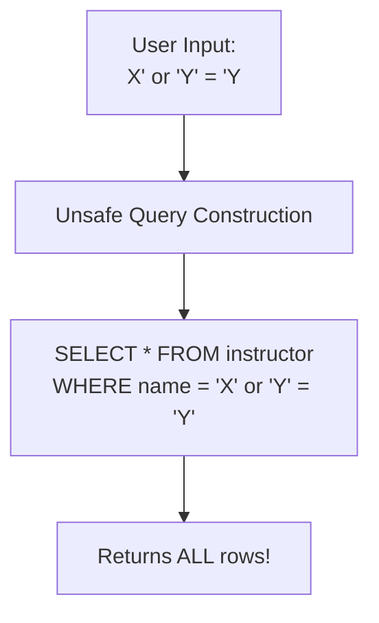
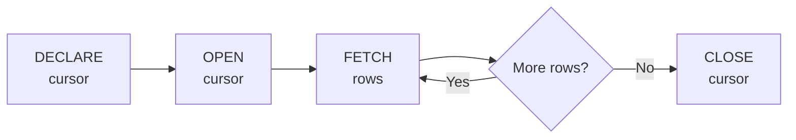
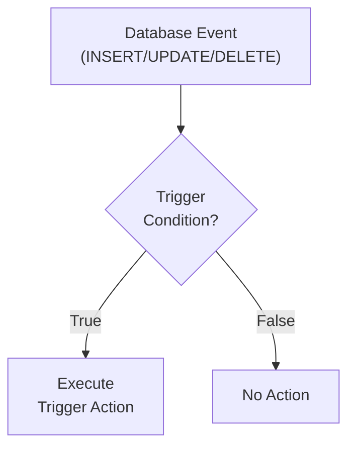
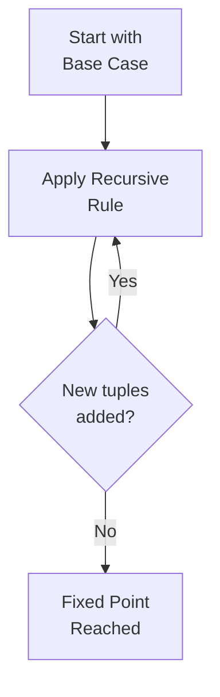
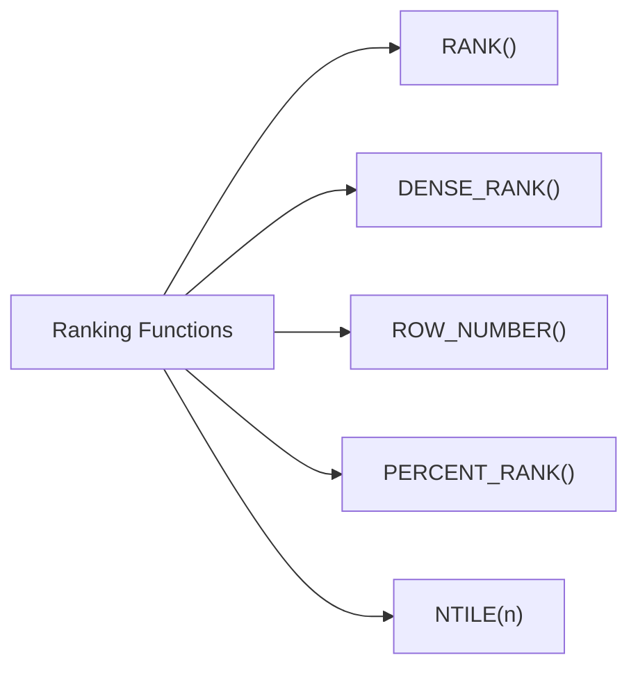
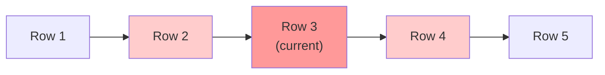
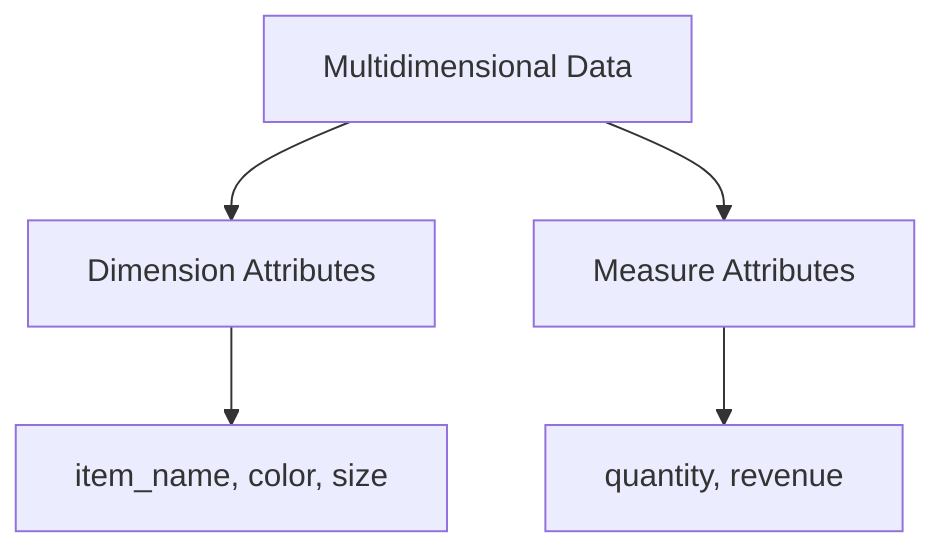
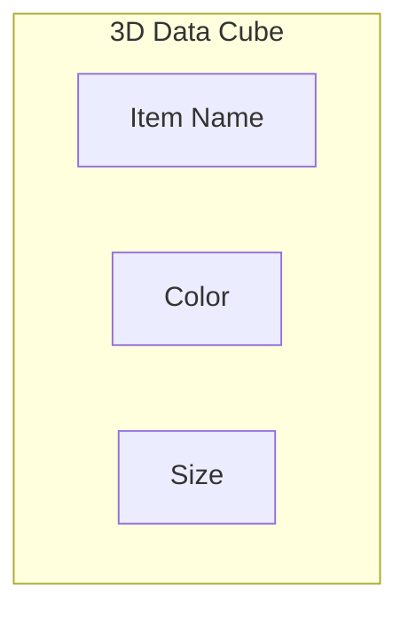

# Chapter 5: Advanced SQL

## Overview

This chapter covers advanced SQL features including accessing SQL from programming languages, functions and procedures, triggers, recursive queries, and advanced aggregation features for OLAP.

---

## Accessing SQL from a Programming Language

### Why Access SQL from Programming Languages?

| Reason | Description |
|--------|-------------|
| **Expressiveness** | SQL lacks full power of general-purpose languages |
| **Non-declarative actions** | Printing reports, GUI interaction, etc. |

### Two Approaches



---

## JDBC (Java Database Connectivity)

### JDBC Model



### Basic JDBC Steps

| Step | Description |
|------|-------------|
| 1. Open Connection | Connect to database server |
| 2. Create Statement | Create statement object |
| 3. Execute Query | Send SQL and fetch results |
| 4. Handle Exceptions | Catch and process errors |
| 5. Close Resources | Release connections |

### JDBC Code Example

```java
public static void JDBCexample(String dbid, String userid, String passwd) {
    try (Connection conn = DriverManager.getConnection(
            "jdbc:oracle:thin:@db.yale.edu:2000:univdb", userid, passwd);
         Statement stmt = conn.createStatement()) {

        // Execute update
        stmt.executeUpdate(
            "INSERT INTO instructor VALUES('77987', 'Kim', 'Physics', 98000)");

        // Execute query
        ResultSet rset = stmt.executeQuery(
            "SELECT dept_name, avg(salary) FROM instructor GROUP BY dept_name");

        while (rset.next()) {
            System.out.println(rset.getString("dept_name") + " " +
                             rset.getFloat(2));
        }
    } catch (SQLException sqle) {
        System.out.println("SQLException: " + sqle);
    }
}
```

### ResultSet Methods

| Method | Description |
|--------|-------------|
| `getString(col)` | Get string value by column name or index |
| `getInt(col)` | Get integer value |
| `getFloat(col)` | Get float value |
| `next()` | Move to next row |
| `wasNull()` | Check if last read value was NULL |

### Prepared Statements (Preventing SQL Injection)

```java
// SAFE: Using PreparedStatement
PreparedStatement pStmt = conn.prepareStatement(
    "INSERT INTO instructor VALUES(?,?,?,?)");
pStmt.setString(1, "88877");
pStmt.setString(2, "Perry");
pStmt.setString(3, "Finance");
pStmt.setInt(4, 125000);
pStmt.executeUpdate();

// DANGEROUS: String concatenation - NEVER DO THIS!
// "INSERT INTO instructor VALUES('" + ID + "', '" + name + "', ...)"
```

### SQL Injection Attack Example



```
Input: X'; UPDATE instructor SET salary = salary + 10000; --
Result: Executes unauthorized UPDATE!
```

### Metadata Features

```java
// ResultSet metadata
ResultSetMetaData rsmd = rs.getMetaData();
for (int i = 1; i <= rsmd.getColumnCount(); i++) {
    System.out.println(rsmd.getColumnName(i));
    System.out.println(rsmd.getColumnTypeName(i));
}

// Database metadata
DatabaseMetaData dbmd = conn.getMetaData();
ResultSet rs = dbmd.getColumns(null, "univdb", "department", "%");
ResultSet tables = dbmd.getTables("", "", "%", new String[]{"TABLES"});
ResultSet pks = dbmd.getPrimaryKeys("", "", tableName);
```

### Transaction Control in JDBC

```java
// Disable auto-commit
conn.setAutoCommit(false);

try {
    // Multiple updates
    stmt.executeUpdate("UPDATE account SET balance = balance - 100 WHERE id = 1");
    stmt.executeUpdate("UPDATE account SET balance = balance + 100 WHERE id = 2");

    conn.commit();  // Commit transaction
} catch (SQLException e) {
    conn.rollback();  // Rollback on error
}
```

---

## ODBC (Open Database Connectivity)

| Feature | Description |
|---------|-------------|
| **Purpose** | Standard API for database communication |
| **Languages** | C, C++, and other languages |
| **Applications** | GUI tools, spreadsheets, etc. |

---

## Embedded SQL

SQL statements embedded directly in host language code.

### Syntax

```c
EXEC SQL <embedded SQL statement>;

// Variable declaration
EXEC SQL BEGIN DECLARE SECTION;
    int credit_amount;
EXEC SQL END DECLARE SECTION;

// Connect to database
EXEC SQL CONNECT TO server USER user_name USING password;
```

### Cursor Operations



```c
// Declare cursor
EXEC SQL
    DECLARE c CURSOR FOR
    SELECT ID, name
    FROM student
    WHERE tot_cred > :credit_amount;

// Open cursor
EXEC SQL OPEN c;

// Fetch rows
EXEC SQL FETCH c INTO :si, :sn;

// Close cursor
EXEC SQL CLOSE c;
```

### Updates Through Cursors

```c
EXEC SQL
    DECLARE c CURSOR FOR
    SELECT *
    FROM instructor
    WHERE dept_name = 'Music'
    FOR UPDATE;

// After fetching each tuple:
UPDATE instructor
SET salary = salary + 1000
WHERE CURRENT OF c;
```

---

## Functions and Procedures

Functions and procedures store business logic in the database.

### SQL Functions

```sql
-- Create function
CREATE FUNCTION dept_count(dept_name VARCHAR(20))
RETURNS INTEGER
BEGIN
    DECLARE d_count INTEGER;
    SELECT COUNT(*) INTO d_count
    FROM instructor
    WHERE instructor.dept_name = dept_name;
    RETURN d_count;
END;

-- Use function
SELECT dept_name, budget
FROM department
WHERE dept_count(dept_name) > 12;
```

### Table Functions

```sql
-- Function returning a table
CREATE FUNCTION instructor_of(dept_name CHAR(20))
RETURNS TABLE (
    ID VARCHAR(5),
    name VARCHAR(20),
    dept_name VARCHAR(20),
    salary NUMERIC(8,2)
)
RETURN TABLE (
    SELECT ID, name, dept_name, salary
    FROM instructor
    WHERE instructor.dept_name = instructor_of.dept_name
);

-- Usage
SELECT * FROM TABLE(instructor_of('Music'));
```

### Language Constructs

```sql
-- FOR loop
DECLARE n INTEGER DEFAULT 0;
FOR r AS
    SELECT budget FROM department
    WHERE dept_name = 'Music'
DO
    SET n = n + r.budget;
END FOR;
```

### External Language Routines

```sql
-- C procedure
CREATE PROCEDURE dept_count_proc(IN dept_name VARCHAR(20), OUT count INTEGER)
LANGUAGE C
EXTERNAL NAME '/usr/avi/bin/dept_count_proc';

-- C function
CREATE FUNCTION dept_count(dept_name VARCHAR(20))
RETURNS INTEGER
LANGUAGE C
EXTERNAL NAME '/usr/avi/bin/dept_count';
```

### Security Considerations

| Approach | Description |
|----------|-------------|
| **Sandbox** | Use safe languages (Java) |
| **Separate Process** | Run in isolated process with IPC |
| **Direct Execution** | Run in database address space (risky) |

---

## Triggers

A **trigger** is a statement automatically executed as a side effect of database modification.



### Trigger Components

| Component | Description |
|-----------|-------------|
| **Event** | INSERT, UPDATE, DELETE |
| **Condition** | WHEN clause (optional) |
| **Action** | SQL statements to execute |
| **Timing** | BEFORE or AFTER |
| **Granularity** | FOR EACH ROW or FOR EACH STATEMENT |

### Trigger Example

```sql
-- Trigger to maintain total credits
CREATE TRIGGER credits_earned
AFTER UPDATE OF takes ON (grade)
REFERENCING NEW ROW AS nrow
REFERENCING OLD ROW AS orow
FOR EACH ROW
WHEN nrow.grade <> 'F' AND nrow.grade IS NOT NULL
     AND (orow.grade = 'F' OR orow.grade IS NULL)
BEGIN ATOMIC
    UPDATE student
    SET tot_cred = tot_cred + (
        SELECT credits
        FROM course
        WHERE course.course_id = nrow.course_id
    )
    WHERE student.id = nrow.id;
END;
```

### Statement-Level Triggers

```sql
-- Use transition tables instead of row references
CREATE TRIGGER summary_update
AFTER UPDATE ON sales
REFERENCING OLD TABLE AS old_sales
REFERENCING NEW TABLE AS new_sales
FOR EACH STATEMENT
BEGIN
    -- Process all affected rows at once
END;
```

### When NOT to Use Triggers

| Situation | Better Alternative |
|-----------|-------------------|
| Maintaining summary data | Materialized views |
| Database replication | Built-in replication |
| Field validation | Application methods/encapsulation |

**Risks:**
- Unintended execution during data load/backup
- Cascading execution
- Critical transaction failures

---

## Recursive Queries

SQL:1999 permits recursive view definitions for queries like transitive closure.

### Recursive CTE Syntax

```sql
WITH RECURSIVE rec_prereq(course_id, prereq_id) AS (
    -- Base case
    SELECT course_id, prereq_id
    FROM prereq

    UNION

    -- Recursive case
    SELECT rec_prereq.course_id, prereq.prereq_id
    FROM rec_prereq, prereq
    WHERE rec_prereq.prereq_id = prereq.course_id
)
SELECT * FROM rec_prereq;
```

### Fixed-Point Computation



| Iteration | Description |
|-----------|-------------|
| Base | Direct prerequisites |
| 1st recursion | Prerequisites of prerequisites |
| 2nd recursion | 3 levels deep |
| ... | Continue until no new tuples |

---

## Advanced Aggregation Features

### Ranking Functions



| Function | Description | Gaps |
|----------|-------------|------|
| `RANK()` | Rank with gaps for ties | Yes |
| `DENSE_RANK()` | Rank without gaps | No |
| `ROW_NUMBER()` | Unique row number | N/A |
| `PERCENT_RANK()` | Percentile rank (0-1) | N/A |
| `CUME_DIST()` | Cumulative distribution | N/A |
| `NTILE(n)` | Divide into n buckets | N/A |

### Ranking Examples

```sql
-- Basic ranking
SELECT ID, RANK() OVER (ORDER BY GPA DESC) AS s_rank
FROM student_grades
ORDER BY s_rank;

-- Ranking with ties (RANK vs DENSE_RANK)
-- GPA: 4.0, 4.0, 3.8
-- RANK():       1, 1, 3  (gap at 2)
-- DENSE_RANK(): 1, 1, 2  (no gap)

-- Ranking within partitions
SELECT ID, dept_name,
       RANK() OVER (PARTITION BY dept_name ORDER BY GPA DESC) AS dept_rank
FROM dept_grades
ORDER BY dept_name, dept_rank;

-- NTILE: divide into quartiles
SELECT ID, NTILE(4) OVER (ORDER BY GPA DESC) AS quartile
FROM student_grades;
```

### Windowing Functions

Window functions compute aggregates over a sliding window of rows.



```sql
-- Moving average (previous, current, next)
SELECT date, SUM(value) OVER (
    ORDER BY date
    ROWS BETWEEN 1 PRECEDING AND 1 FOLLOWING
) AS moving_avg
FROM sales;

-- Cumulative sum
SELECT date, SUM(value) OVER (
    ORDER BY date
    ROWS UNBOUNDED PRECEDING
) AS cumulative_total
FROM sales;
```

### Window Specifications

| Specification | Description |
|---------------|-------------|
| `ROWS BETWEEN 1 PRECEDING AND 1 FOLLOWING` | 3-row window |
| `ROWS UNBOUNDED PRECEDING` | All rows up to current |
| `RANGE BETWEEN 10 PRECEDING AND CURRENT ROW` | Value-based range |
| `RANGE INTERVAL 10 DAY PRECEDING` | Time-based range |

### Windowing with Partitions

```sql
-- Running balance per account
SELECT account_number, date_time,
       SUM(value) OVER (
           PARTITION BY account_number
           ORDER BY date_time
           ROWS UNBOUNDED PRECEDING
       ) AS balance
FROM transaction
ORDER BY account_number, date_time;
```

---

## OLAP (Online Analytical Processing)

### Multidimensional Data



| Attribute Type | Purpose | Example |
|----------------|---------|---------|
| **Dimension** | Define viewing dimensions | item_name, color, size |
| **Measure** | Values to aggregate | quantity, revenue |

### Cross-Tabulation (Pivot Table)

```
              | dark  | pastel | white | Total
--------------+-------+--------+-------+-------
Skirt         |  8    |  35    |  10   |  53
Dress         |  20   |  10    |  5    |  35
Shirt         |  14   |  7     |  28   |  49
Pants         |  6    |  2     |  5    |  13
--------------+-------+--------+-------+-------
Total         |  48   |  54    |  48   | 150
```

### Data Cube



### OLAP Operations

| Operation | Description |
|-----------|-------------|
| **Pivoting** | Change dimensions in cross-tab |
| **Slicing** | Fix value for one dimension |
| **Dicing** | Fix values for multiple dimensions |
| **Roll-up** | Move to coarser granularity |
| **Drill-down** | Move to finer granularity |

### CUBE and ROLLUP

```sql
-- CUBE: all possible groupings (2^n combinations)
SELECT item_name, color, size, SUM(quantity)
FROM sales
GROUP BY CUBE(item_name, color, size);

-- Generates groupings:
-- (item_name, color, size), (item_name, color), (item_name, size),
-- (color, size), (item_name), (color), (size), ()
```

```sql
-- ROLLUP: prefix groupings only
SELECT item_name, color, size, SUM(quantity)
FROM sales
GROUP BY ROLLUP(item_name, color, size);

-- Generates groupings:
-- (item_name, color, size), (item_name, color), (item_name), ()
```

### GROUPING Function

```sql
-- Distinguish NULL from "all" aggregates
SELECT item_name, color, size, SUM(quantity),
       GROUPING(item_name) AS item_flag,
       GROUPING(color) AS color_flag,
       GROUPING(size) AS size_flag
FROM sales
GROUP BY CUBE(item_name, color, size);

-- GROUPING returns 1 for aggregate rows, 0 otherwise
```

### Combining CUBE and ROLLUP

```sql
-- Cross product of groupings
SELECT item_name, color, size, SUM(quantity)
FROM sales
GROUP BY ROLLUP(item_name), ROLLUP(color, size);

-- Generates: {item_name, ()} X {(color, size), (color), ()}
```

### OLAP Implementation Types

| Type | Description |
|------|-------------|
| **MOLAP** | Multidimensional arrays in memory |
| **ROLAP** | Relational database features only |
| **HOLAP** | Hybrid: summaries in memory, base data in RDBMS |

---

## Summary

| Topic | Key Concepts |
|-------|--------------|
| **JDBC** | Connection, Statement, ResultSet, PreparedStatement |
| **SQL Injection** | Always use PreparedStatement with parameters |
| **Embedded SQL** | EXEC SQL, cursors, host variables |
| **Functions** | Scalar functions, table functions |
| **Procedures** | IN/OUT parameters, external routines |
| **Triggers** | Event-condition-action, row/statement level |
| **Recursion** | WITH RECURSIVE, transitive closure |
| **Ranking** | RANK, DENSE_RANK, ROW_NUMBER, NTILE |
| **Windowing** | OVER, PARTITION BY, ROWS/RANGE |
| **OLAP** | CUBE, ROLLUP, GROUPING, data cubes |
