# Chapter 6: Database Design Using the E-R Model

## Overview

The Entity-Relationship (E-R) model is a conceptual design approach that models an enterprise as a collection of entities and relationships. This chapter covers E-R concepts, diagrams, and conversion to relational schemas.

---

## Database Design Phases


| Phase | Description | Decisions |
|-------|-------------|-----------|
| **Initial** | Characterize data needs | What data to collect |
| **Conceptual** | Create E-R model | Entities, relationships, constraints |
| **Logical** | Convert to schema | Relation schemas, attribute distribution |
| **Physical** | Storage layout | Indexes, partitioning, file organization |

### Design Pitfalls to Avoid

| Pitfall | Description |
|---------|-------------|
| **Redundancy** | Repeated information leading to inconsistency |
| **Incompleteness** | Cannot model certain aspects of enterprise |

---

## Entity Sets

An **entity** is an object that exists and is distinguishable from other objects.

An **entity set** is a set of entities of the same type sharing the same properties.


### E-R Diagram Notation for Entities

| Symbol | Meaning |
|--------|---------|
| Rectangle | Entity set |
| Attributes inside | Properties of entity |
| Underlined attribute | Primary key |

---

## Relationship Sets

A **relationship** is an association among several entities.

A **relationship set** is a set of relationships of the same type.


### Relationship Set Properties

| Property | Description |
|----------|-------------|
| **Degree** | Number of entity sets participating |
| **Attributes** | Descriptive properties of relationship |
| **Roles** | Labels when same entity set appears multiple times |

### Relationship with Attributes


### Roles in Relationships

When the same entity set participates multiple times in a relationship:


### Degree of Relationships

| Degree | Name | Example |
|--------|------|---------|
| 2 | Binary | student-advisor |
| 3 | Ternary | student-instructor-project |
| n | N-ary | Multiple entity sets |

---

## Attributes

### Attribute Types


| Type | Description | Example |
|------|-------------|---------|
| **Simple** | Cannot be divided | ID, salary |
| **Composite** | Can be divided into subparts | name (first, middle, last) |
| **Single-valued** | One value per entity | ID |
| **Multivalued** | Multiple values per entity | phone_numbers |
| **Derived** | Computed from other attributes | age (from date_of_birth) |

### Composite Attribute Structure

```
name
├── first_name
├── middle_initial
└── last_name

address
├── street
│   ├── street_number
│   ├── street_name
│   └── apartment_number
├── city
├── state
└── postal_code
```

---

## Mapping Cardinality Constraints

Cardinality constraints express the number of entities that can be associated via a relationship.

### Types of Cardinalities


| Cardinality | Description | Example |
|-------------|-------------|---------|
| **One-to-One (1:1)** | Each A associates with at most one B, and vice versa | Country-Capital |
| **One-to-Many (1:N)** | Each A can associate with many B's, each B with one A | Department-Employees |
| **Many-to-One (N:1)** | Each A associates with one B, each B can have many A's | Employees-Department |
| **Many-to-Many (M:N)** | Each A can associate with many B's and vice versa | Students-Courses |

### E-R Diagram Notation for Cardinality

| Symbol | Meaning |
|--------|---------|
| `→` (arrow) | "One" side |
| `—` (line) | "Many" side |
| `=` (double line) | Total participation |
| `l..h` notation | Minimum l, maximum h |

### Participation Constraints


| Participation | Notation | Meaning |
|---------------|----------|---------|
| **Total** | Double line (=) | Every entity must participate |
| **Partial** | Single line (-) | Some entities may not participate |

### Min-Max Notation

```
Example: 0..* on instructor side, 1..1 on student side
- Instructor can advise 0 or more students
- Student must have exactly 1 advisor
```

---

## Primary Keys

### Primary Key for Entity Sets

- Attributes that uniquely identify each entity
- Underlined in E-R diagrams

### Primary Key for Relationship Sets

| Cardinality | Primary Key |
|-------------|-------------|
| Many-to-Many | Union of PKs of both entity sets |
| One-to-Many | PK of the "Many" side |
| Many-to-One | PK of the "Many" side |
| One-to-One | PK of either entity set |

---

## Weak Entity Sets

A **weak entity set** depends on another entity (identifying entity) for its existence.


### Weak Entity Set Concepts

| Term | Description |
|------|-------------|
| **Weak Entity Set** | Cannot be uniquely identified by its own attributes |
| **Strong Entity Set** | Has sufficient attributes for unique identification |
| **Identifying Entity Set** | Strong entity that "owns" the weak entity |
| **Identifying Relationship** | Links weak entity to identifying entity |
| **Discriminator** | Partial key that distinguishes weak entities |

### E-R Notation for Weak Entities

| Symbol | Meaning |
|--------|---------|
| Double rectangle | Weak entity set |
| Dashed underline | Discriminator (partial key) |
| Double diamond | Identifying relationship |

**Primary Key of Weak Entity** = PK of identifying entity + Discriminator

Example: `section` PK = (course_id, sec_id, semester, year)

---

## Reduction to Relational Schemas

### Converting Entity Sets

| Entity Type | Conversion Rule |
|-------------|-----------------|
| **Strong Entity** | Schema with same attributes |
| **Weak Entity** | Schema with own attributes + PK of identifying entity |

```sql
-- Strong entity
student(ID, name, tot_cred)

-- Weak entity (section depends on course)
section(course_id, sec_id, semester, year)
```

### Converting Composite Attributes

Flatten composite attributes into separate columns:

```sql
-- Composite name (first_name, middle_initial, last_name)
instructor(ID, first_name, middle_initial, last_name,
           street_number, street_name, apt_number,
           city, state, zip_code, date_of_birth)
```

### Converting Multivalued Attributes

Create a separate schema:

```sql
-- Multivalued phone_number for instructor
inst_phone(ID, phone_number)

-- Each phone number becomes a separate tuple
-- (22222, '456-7890')
-- (22222, '123-4567')
```

### Converting Relationship Sets

| Cardinality | Conversion Rule |
|-------------|-----------------|
| **Many-to-Many** | New schema with PKs of both entities + relationship attributes |
| **One-to-Many (Total)** | Add PK of "One" side as FK to "Many" side |
| **Many-to-One (Total)** | Add PK of "One" side as FK to "Many" side |
| **One-to-One** | Add FK to either side |

```sql
-- Many-to-Many: separate table
advisor(student_id, instructor_id, date)

-- One-to-Many: add FK to "Many" side
-- Instead of separate inst_dept table:
instructor(ID, name, salary, dept_name)  -- dept_name is FK
```

### Schema Redundancy Rules

| Situation | Rule |
|-----------|------|
| Weak entity's identifying relationship | Redundant (already in weak entity schema) |
| One-to-Many with total participation | Can merge into "Many" side schema |
| Partial participation | May result in NULL values if merged |

---

## Extended E-R Features

### Specialization (Top-Down)

Designate sub-groupings within an entity set with distinctive features.


### Generalization (Bottom-Up)

Combine entity sets with common features into a higher-level entity set.

### Specialization/Generalization Constraints

| Constraint | Options | Description |
|------------|---------|-------------|
| **Disjointness** | Disjoint / Overlapping | Can entity belong to multiple lower-level sets? |
| **Completeness** | Total / Partial | Must entity belong to some lower-level set? |

### Converting Specialization to Schemas

**Method 1: Separate Tables**
```sql
person(ID, name, address)
employee(ID, salary)           -- ID references person
student(ID, tot_cred)          -- ID references person
```
*Drawback: Need join to get complete information*

**Method 2: Combined Tables**
```sql
employee(ID, name, address, salary)
student(ID, name, address, tot_cred)
```
*Drawback: Redundancy for overlapping entities*

---

## Aggregation

Treat a relationship as an abstract entity to allow relationships between relationships.


### Converting Aggregation to Schema

```sql
-- Aggregated relationship becomes entity
eval_for(student_id, project_id, instructor_id, evaluation_id)
```

---

## Design Decisions

### Entity vs. Attribute

| Use Entity When | Use Attribute When |
|-----------------|-------------------|
| Need extra information about the item | Simple value |
| Item has multiple values | Single value |
| Item participates in relationships | No relationships needed |


*Use entity for phone if need location, type, etc.*

### Entity vs. Relationship

**Guideline:** Use relationship to describe an *action* between entities.

### Binary vs. Non-Binary Relationships

| Preference | Reason |
|------------|--------|
| Binary | Simpler, allows partial information |
| Non-binary | Shows multi-entity participation clearly |

### Converting N-ary to Binary


---

## E-R Diagram Symbols Summary

### Entity Symbols

| Symbol | Meaning |
|--------|---------|
| Rectangle | Strong entity set |
| Double rectangle | Weak entity set |
| Oval (attached) | Attribute |
| Double oval | Multivalued attribute |
| Dashed oval | Derived attribute |
| Underline | Primary key |
| Dashed underline | Discriminator |

### Relationship Symbols

| Symbol | Meaning |
|--------|---------|
| Diamond | Relationship set |
| Double diamond | Identifying relationship |
| Line | Relationship link |
| Arrow (→) | "One" cardinality |
| Double line | Total participation |

### Specialization Symbols

| Symbol | Meaning |
|--------|---------|
| Triangle with ISA | Specialization/Generalization |
| Disjoint | Subclasses are mutually exclusive |
| Overlapping | Entity can belong to multiple subclasses |

---

## Alternative Notations

### Chen vs. Crow's Foot (IE1FX)

| Feature | Chen | Crow's Foot |
|---------|------|-------------|
| Entity | Rectangle | Rectangle |
| Relationship | Diamond | Line only |
| Cardinality | Arrow/Line | Crow's foot symbols |
| Many | Line | Fork (crow's foot) |
| One | Arrow | Single line |

### UML Class Diagrams

| E-R Concept | UML Equivalent |
|-------------|----------------|
| Entity set | Class |
| Attributes | Class attributes |
| Relationship | Association line |
| Cardinality | Multiplicity notation |
| Specialization | Generalization arrow |

**Note:** UML cardinality position is *reversed* compared to E-R notation.

---

## University Database E-R Example

```mermaid
erDiagram
    student ||--o{ takes : enrolls
    course ||--o{ takes : "is taken"
    course ||--|{ section : has
    instructor ||--o{ teaches : teaches
    section ||--o{ teaches : "is taught"
    department ||--o{ student : has
    department ||--o{ instructor : employs
    department ||--o{ course : offers
    instructor ||--o{ advisor : advises
    student ||--|| advisor : "has advisor"

    student {
        string ID PK
        string name
        numeric tot_cred
    }
    instructor {
        string ID PK
        string name
        numeric salary
    }
    course {
        string course_id PK
        string title
        numeric credits
    }
    section {
        string sec_id PK
        string semester PK
        numeric year PK
    }
    department {
        string dept_name PK
        string building
        numeric budget
    }
```



---

## Key Takeaways

| Concept | Purpose |
|---------|---------|
| **Entity Sets** | Model real-world objects |
| **Relationship Sets** | Model associations between entities |
| **Attributes** | Describe properties |
| **Cardinality** | Constrain relationship participation |
| **Weak Entities** | Model dependent entities |
| **Specialization** | Model subtype hierarchies |
| **Aggregation** | Model relationships of relationships |
| **Reduction to Schema** | Convert E-R to relational tables |
