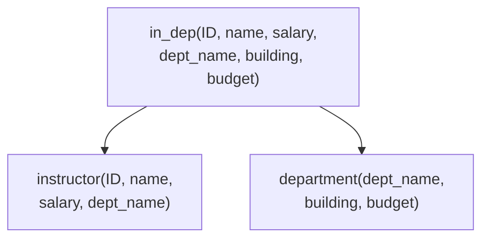
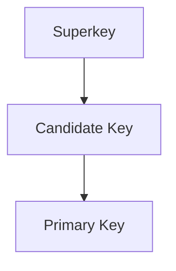
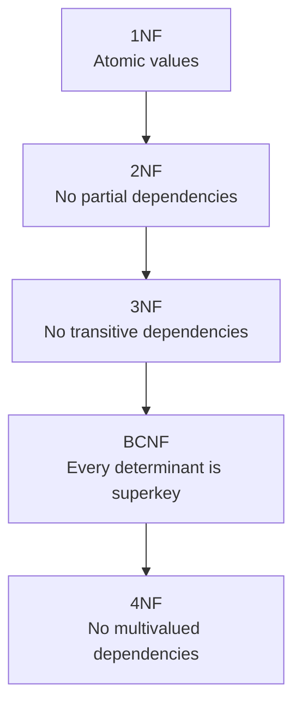
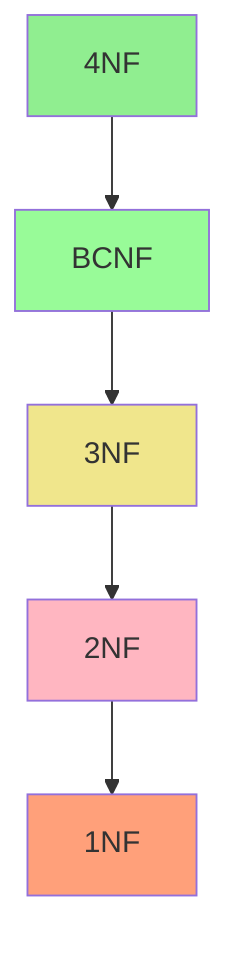
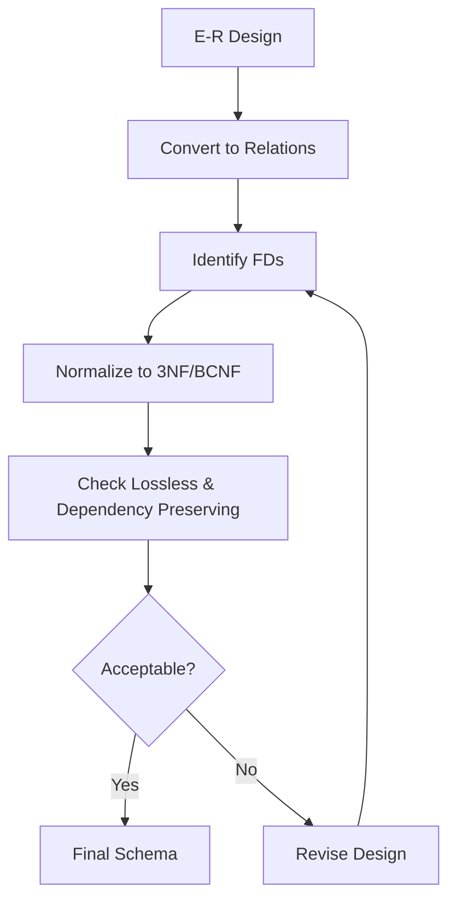

# Chapter 7: Normalization

## Overview

Normalization is the process of organizing database schemas to reduce redundancy and dependency. This chapter covers functional dependencies, normal forms (1NF, 2NF, 3NF, BCNF, 4NF), and decomposition algorithms.

---

## Features of Good Relational Design

### Problems with Bad Design

| Problem | Description | Example |
|---------|-------------|---------|
| **Redundancy** | Information repeated multiple times | Department info repeated for each instructor |
| **Update Anomalies** | Inconsistency when updating | Changing building name requires multiple updates |
| **Insertion Anomalies** | Cannot add data without other data | Cannot add department without instructor |
| **Deletion Anomalies** | Losing data unintentionally | Deleting last instructor loses department info |

### Example of Bad Design

```
in_dep(ID, name, salary, dept_name, building, budget)
```

| ID | name | salary | dept_name | building | budget |
|----|------|--------|-----------|----------|--------|
| 101 | Wu | 90000 | Finance | Painter | 120000 |
| 102 | Einstein | 95000 | Physics | Watson | 70000 |
| 103 | Gold | 87000 | Physics | Watson | 70000 |

**Problems:** Physics department info (building, budget) is repeated.

---

## Decomposition

Decomposition splits a relation into smaller relations to eliminate redundancy.



### Lossless vs. Lossy Decomposition

| Type | Definition | Result |
|------|------------|--------|
| **Lossless** | Can reconstruct original relation | R₁ ⋈ R₂ = R |
| **Lossy** | Cannot reconstruct (spurious tuples) | R₁ ⋈ R₂ ⊃ R |

### Condition for Lossless Decomposition

A decomposition of R into R₁ and R₂ is **lossless** if at least one holds:
- R₁ ∩ R₂ → R₁ (common attributes determine R₁)
- R₁ ∩ R₂ → R₂ (common attributes determine R₂)

```
Example: R = (A, B, C), F = {A → B, B → C}

Lossless: R₁ = (A, B), R₂ = (B, C)
  R₁ ∩ R₂ = {B}, and B → BC ✓

Lossy: R₁ = (A, B), R₂ = (A, C)  when only A → B holds
```

---

## Functional Dependencies

### Definition

A functional dependency **α → β** holds on R if for any two tuples t₁ and t₂:

```
t₁[α] = t₂[α] ⟹ t₁[β] = t₂[β]
```

"If two tuples agree on α, they must agree on β"

### Examples

| Dependency | Meaning |
|------------|---------|
| ID → name | ID determines name |
| dept_name → building | Department determines building |
| course_id, sec_id, semester, year → building | Section determines building |

### Trivial Functional Dependencies

A FD is **trivial** if β ⊆ α (always satisfied).

| Example | Trivial? |
|---------|----------|
| ID, name → ID | Yes (ID ⊆ {ID, name}) |
| name → name | Yes |
| ID → name | No |

---

## Keys and Functional Dependencies



| Term | Definition |
|------|------------|
| **Superkey** | K → R (determines all attributes) |
| **Candidate Key** | Minimal superkey (no proper subset is superkey) |
| **Primary Key** | Chosen candidate key |

### Example

```
R = (A, B, C, G, H, I)
F = {A → B, A → C, CG → H, CG → I, B → H}

Is AG a candidate key?
1. (AG)⁺ = ABCGHI = R  ✓ (AG is superkey)
2. (A)⁺ = ABCH ≠ R     ✓ (A alone not superkey)
3. (G)⁺ = G ≠ R        ✓ (G alone not superkey)
∴ AG is a candidate key
```

---

## Closure of Functional Dependencies (F⁺)

The **closure F⁺** is the set of all FDs logically implied by F.

### Armstrong's Axioms

| Axiom | Rule | Example |
|-------|------|---------|
| **Reflexivity** | If β ⊆ α, then α → β | AB → A |
| **Augmentation** | If α → β, then αγ → βγ | A → B implies AC → BC |
| **Transitivity** | If α → β and β → γ, then α → γ | A → B, B → C implies A → C |

### Additional Rules (Derived)

| Rule | Statement |
|------|-----------|
| **Union** | If α → β and α → γ, then α → βγ |
| **Decomposition** | If α → βγ, then α → β and α → γ |
| **Pseudotransitivity** | If α → β and γβ → δ, then αγ → δ |

---

## Attribute Closure (α⁺)

The **attribute closure α⁺** is the set of all attributes functionally determined by α.

### Algorithm

```
result := α
while (changes to result) do
    for each β → γ in F do
        if β ⊆ result then
            result := result ∪ γ
```

### Example

```
R = (A, B, C, G, H, I)
F = {A → B, A → C, CG → H, CG → I, B → H}

Compute (AG)⁺:
1. result = AG
2. result = ABCG    (A → B, A → C)
3. result = ABCGH   (CG → H)
4. result = ABCGHI  (CG → I)

(AG)⁺ = ABCGHI
```

### Uses of Attribute Closure

| Use | How |
|-----|-----|
| Test if α is superkey | Check if α⁺ = R |
| Test if α → β holds | Check if β ⊆ α⁺ |
| Compute F⁺ | For each α ⊆ R, output α → S for each S ⊆ α⁺ |

---

## Canonical Cover (Fᶜ)

A **canonical cover** Fᶜ is a minimal set of FDs equivalent to F:
- No extraneous attributes
- Each left side is unique
- F⁺ = Fᶜ⁺

### Extraneous Attributes

| Location | Test |
|----------|------|
| A extraneous in **α** of α → β | Check if (α - A)⁺ includes β |
| A extraneous in **β** of α → β | Check if α⁺ (under F') includes A, where F' = (F - {α → β}) ∪ {α → (β - A)} |

### Computing Canonical Cover

```
repeat
    1. Use union rule: α → β₁, α → β₂  becomes  α → β₁β₂
    2. Find and remove extraneous attributes
until Fᶜ doesn't change
```

### Example

```
F = {A → BC, B → C, A → B, AB → C}

Step 1: Combine A → BC and A → B → A → BC
        Result: {A → BC, B → C, AB → C}

Step 2: A is extraneous in AB → C (since B → C exists)
        Result: {A → BC, B → C}

Step 3: C is extraneous in A → BC (A → B and B → C implies A → C)
        Result: {A → B, B → C}

Canonical Cover: Fᶜ = {A → B, B → C}
```

---

## Normal Forms



### Normal Forms Comparison

| Normal Form | Requirement | Issues Addressed |
|-------------|-------------|------------------|
| **1NF** | All attributes are atomic | Non-atomic values |
| **2NF** | 1NF + no partial dependencies | Partial key dependencies |
| **3NF** | 2NF + no transitive dependencies | Some redundancy, but dependency preserving |
| **BCNF** | Every non-trivial FD has superkey on left | All FD-based redundancy |
| **4NF** | BCNF + no non-trivial MVDs | Multivalued dependency redundancy |

---

## First Normal Form (1NF)

A relation is in **1NF** if all attribute domains are **atomic** (indivisible).

| Non-Atomic | Problem |
|------------|---------|
| Set of values | {phone1, phone2} |
| Composite attributes | name = (first, last) |
| Encoded values | CS101 → extracting "CS" |

---

## Boyce-Codd Normal Form (BCNF)

A relation R is in **BCNF** if for every non-trivial FD α → β:
- **α is a superkey for R**

### BCNF Test

```
For each α → β in F:
    Compute α⁺
    If α⁺ ≠ R, then R is not in BCNF
```

### BCNF Decomposition Algorithm

```
result := {R}
while (there is Rᵢ in result not in BCNF) do
    Let α → β be a FD violating BCNF on Rᵢ
    Replace Rᵢ with:
        (α ∪ β)           -- new relation with FD
        (Rᵢ - (β - α))    -- remaining attributes
```

### BCNF Decomposition Example

```
class(course_id, title, dept_name, credits, sec_id,
      semester, year, building, room_number, capacity, time_slot_id)

FDs:
- course_id → title, dept_name, credits
- building, room_number → capacity
- course_id, sec_id, semester, year → building, room_number, time_slot_id

Candidate Key: {course_id, sec_id, semester, year}

Decomposition:
1. course_id → title, dept_name, credits violates BCNF
   Split into:
   - course(course_id, title, dept_name, credits)
   - class-1(course_id, sec_id, semester, year, building,
             room_number, capacity, time_slot_id)

2. building, room_number → capacity violates BCNF in class-1
   Split into:
   - classroom(building, room_number, capacity)
   - section(course_id, sec_id, semester, year, building,
             room_number, time_slot_id)

Final: course, classroom, section (all in BCNF)
```

---

## Third Normal Form (3NF)

A relation R is in **3NF** if for every non-trivial FD α → β, at least one holds:
- α is a superkey for R, **OR**
- Each attribute A in (β - α) is contained in a candidate key

### 3NF vs BCNF

| Property | BCNF | 3NF |
|----------|------|-----|
| Redundancy | None | Some possible |
| Lossless decomposition | Always | Always |
| Dependency preservation | Not always | Always |

### 3NF Example

```
dept_advisor(s_ID, i_ID, dept_name)
F = {i_ID → dept_name, s_ID, dept_name → i_ID}

Candidate Keys: {s_ID, dept_name}, {s_ID, i_ID}

Check: i_ID → dept_name
- i_ID is not a superkey ✗
- dept_name is in candidate key {s_ID, dept_name} ✓

∴ R is in 3NF (but not BCNF)
```

### 3NF Decomposition Algorithm

```
Compute canonical cover Fᶜ
for each α → β in Fᶜ do
    if no Rⱼ contains αβ then
        Create Rᵢ := αβ

if no Rⱼ contains a candidate key for R then
    Add a relation with any candidate key

Remove redundant relations (subsets of others)
```

### 3NF Decomposition Example

```
R = (customer_id, employee_id, branch_name, type)
F = {customer_id, employee_id → branch_name, type
     employee_id → branch_name
     customer_id, branch_name → employee_id}

Canonical Cover:
Fᶜ = {customer_id, employee_id → type
      employee_id → branch_name
      customer_id, branch_name → employee_id}

3NF Decomposition:
1. (customer_id, employee_id, type)
2. (employee_id, branch_name)
3. (customer_id, branch_name, employee_id)

Remove (employee_id, branch_name) as subset of (3)

Final:
- (customer_id, employee_id, type)
- (customer_id, branch_name, employee_id)
```

---

## Dependency Preservation

A decomposition is **dependency preserving** if all FDs can be checked on individual relations (without joins).

### Test for Dependency Preservation

```
For each α → β in F:
    result := α
    repeat
        for each Rᵢ in decomposition:
            t := (result ∩ Rᵢ)⁺ ∩ Rᵢ
            result := result ∪ t
    until result doesn't change

    If β ⊆ result, then α → β is preserved
```

### Example

```
R = (A, B, C), F = {A → B, B → C}

Decomposition 1: R₁ = (A, B), R₂ = (B, C)
- A → B: checkable in R₁ ✓
- B → C: checkable in R₂ ✓
∴ Dependency preserving

Decomposition 2: R₁ = (A, B), R₂ = (A, C)
- A → B: checkable in R₁ ✓
- B → C: cannot check without join ✗
∴ NOT dependency preserving
```

---

## Multivalued Dependencies (MVDs)

### Definition

α →→ β holds if for tuples with same α value, the β values are independent of other attributes.

```
If t₁[α] = t₂[α], then there exist t₃, t₄ such that:
- t₃[α] = t₄[α] = t₁[α] = t₂[α]
- t₃[β] = t₁[β], t₃[R - α - β] = t₂[R - α - β]
- t₄[β] = t₂[β], t₄[R - α - β] = t₁[R - α - β]
```

### MVD Example

```
inst_info(ID, child_name, phone_number)

ID    | child_name | phone_number
99999 | David      | 512-555-1234
99999 | David      | 512-555-4321
99999 | William    | 512-555-1234
99999 | William    | 512-555-4321

MVDs: ID →→ child_name, ID →→ phone_number
```

**Problem:** Adding a phone requires adding tuples for ALL children.

### Relationship: FD implies MVD

If α → β, then α →→ β (every FD is also an MVD).

---

## Fourth Normal Form (4NF)

A relation R is in **4NF** if for every non-trivial MVD α →→ β:
- **α is a superkey for R**

### 4NF Decomposition Algorithm

```
result := {R}
while (there is Rᵢ not in 4NF) do
    Let α →→ β be an MVD violating 4NF
    Replace Rᵢ with:
        (α, β)
        (Rᵢ - β)
```

### 4NF Example

```
inst_info(ID, child_name, phone_number)

MVDs: ID →→ child_name, ID →→ phone_number
ID is not a superkey (no FDs)

Decompose into:
- inst_child(ID, child_name)
- inst_phone(ID, phone_number)

Both are in 4NF.
```

---

## Normal Forms Hierarchy



| If in... | Then also in... |
|----------|-----------------|
| 4NF | BCNF, 3NF, 2NF, 1NF |
| BCNF | 3NF, 2NF, 1NF |
| 3NF | 2NF, 1NF |
| 2NF | 1NF |

---

## Design Goals Summary

### Ideal Goals

1. **BCNF** (eliminate all redundancy from FDs)
2. **Lossless decomposition** (can reconstruct original)
3. **Dependency preservation** (can check FDs efficiently)

### Trade-offs

| If BCNF not dependency preserving | Options |
|-----------------------------------|---------|
| Accept BCNF | Lose easy FD checking |
| Accept 3NF | Keep some redundancy |

---

## Denormalization

Sometimes **denormalization** is used for performance:

| Approach | Pros | Cons |
|----------|------|------|
| Denormalized tables | Faster reads | Update anomalies, redundancy |
| Materialized views | Faster reads, auto-maintained | Storage overhead |

---

## Overall Design Process



---

## Key Formulas and Tests

| Test | Formula/Method |
|------|----------------|
| α is superkey | α⁺ = R |
| α → β holds | β ⊆ α⁺ |
| Lossless decomposition | R₁ ∩ R₂ → R₁ or R₁ ∩ R₂ → R₂ |
| BCNF | ∀ non-trivial α → β: α is superkey |
| 3NF | ∀ non-trivial α → β: α is superkey OR β in candidate key |
| 4NF | ∀ non-trivial α →→ β: α is superkey |

---

## Quick Reference: Decomposition

| Normal Form | Algorithm | Guarantees |
|-------------|-----------|------------|
| **BCNF** | Split on violating FD | Lossless |
| **3NF** | Canonical cover → relations | Lossless + Dependency preserving |
| **4NF** | Split on violating MVD | Lossless |
